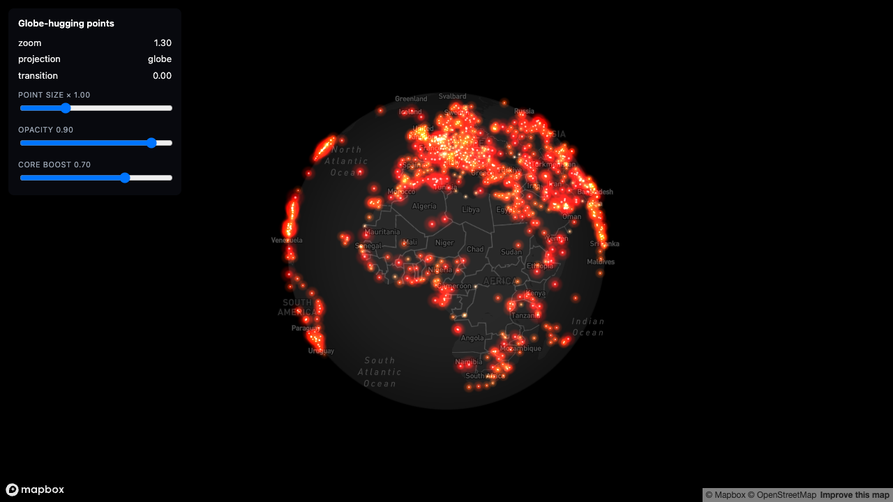

# Globe Custom Layers

**A Mapbox-first cookbook for developers and AI agents building custom globe effects, from glowing points to thousands of animated tracks.**

**[Try the live demo](https://globe-custom-layers.zeabur.app/)** — choose an effect, adjust it, then open its recipe, source, or Agent prompt. Bring your own public Mapbox token, or explore the MapLibre preview without one.



<sup>1,174 airports as a Three.js custom layer on a Mapbox globe. Points sit on the sphere, the far side is culled, and the whole thing blends back to flat Web Mercator as you zoom in. Runnable: [`examples/01-points-on-globe`](examples/01-points-on-globe/).</sup>

> Throughout these pages, *globe-hugging* means geometry that sits on the sphere's surface rather than floating beside it on a flat plane. The runnable examples target Mapbox. The site also has a 🔬 locally reproduced MapLibre 5.24 prelude-based Three.js preview for scenes 01/02/05; its direct ECEF/mainMatrix path, terrain/depth behaviour, and all-nine port remain unverified.

This is a cookbook, not a library. There is nothing to `npm install`. Every recipe is a page of docs plus a standalone runnable example you can read end to end in one sitting, copy, and adapt.

---

## Why this exists

If you put a Three.js custom layer on a web map and then zoom out until the map becomes a globe, your layer does not come with it. Your lines and points stay on a flat plane floating next to the planet, or vanish entirely. Both of those are the same bug wearing different clothes, and neither is covered by the official documentation.

Two facts define the gap this repo fills:

1. **Mapbox GL JS says this is not supported.** Their [globe guide](https://docs.mapbox.com/mapbox-gl-js/guides/globe/) states plainly: *"Globe does not yet support `CustomLayerInterface`."* It is nonetheless achievable — the render callback passes more arguments than the public typings advertise, and with them you can project your own geometry onto the globe. [Recipe 1.1](docs/01-hugging-the-globe/mapbox.md) is how.

2. **MapLibre GL JS supports custom globe layers officially.** Its [simple custom-layer example](https://maplibre.org/maplibre-gl-js/docs/examples/add-a-simple-custom-layer-on-a-globe/) explains projection transitions, horizon clipping, and subdivision; its [Three.js example](https://maplibre.org/maplibre-gl-js/docs/examples/add-a-3d-model-to-globe-using-threejs/) demonstrates a static model. This repo's site has a 🔬 locally browser-reproduced prelude-based adapter for 01/02/05 that reuses the original Three scene geometry and fragment shaders; the direct ECEF/mainMatrix hypothesis remains unverified.

This cookbook records the additional work from production projects: Mapbox's undocumented globe render arguments, batched animation, picking, and the failures that standalone examples can reproduce. Performance measurements describe their stated scene and environment, not a general frame-rate guarantee.

## Explore an effect

The [demo website](site/README.md) introduces three scenes: glowing airport points, global arcs, and mass trajectory playback. The default Mapbox mode is token-gated. The free mode is a clearly labelled MapLibre 5.24 custom-layer preview using the prelude adapter and local data; it keeps the original scene geometry/fragment shaders, but its horizon/limb, blending and depth behaviour differ from Mapbox and are not pixel-identical. Each scene links to its recipe and source and provides a task prompt for your agent. See the [implementation plan](docs/demo-implementation-plan.md) for current acceptance and publication status.

## Use with an agent

Give your agent access to this repository and a concrete task. Start with:

```text
Read AGENTS.md, then use examples/manifest.json to choose an example.
I want [effect] for [data shape and count], with [interaction/playback].
Check whether native Mapbox layers already satisfy the requirement.
Copy a complete example into my project and retain its LICENSE.
Explain the recipe status and which data is synthetic. Pin dependencies.
Verify installation, typecheck and build separately from browser behavior.
In the browser check globe/transition/Mercator, backside visibility, and
the requested interactions. Report anything you could not verify.
```

The website's scene prompts provide more specific starting points. Generating code and passing the inherited math tests does not by itself verify new interactions.

## What this is not

- Not a library, not a framework, not an abstraction layer. If you want one of those, [threebox](https://github.com/jscastro76/threebox) wraps Mapbox × Three.js nicely (though it predates globe projection), and [deck.gl](https://deck.gl/) will aggregate large datasets on the GPU for you (its `GlobeView` is still marked experimental).
- Not a general Three.js tutorial. Start with [three.js fundamentals](https://threejs.org/manual/) or [WebGL fundamentals](https://webglfundamentals.org/) if shaders and buffers are new.
- Not a substitute for reading your map library's source. Several recipes here exist *because* someone read it.

## Recipes

### 1. Hugging the globe

Getting your own geometry to sit on the sphere instead of floating beside it.

| | |
|---|---|
| [1.1 Mapbox GL JS](docs/01-hugging-the-globe/mapbox.md) | The undocumented render arguments, the ECEF math, and why every material needs `depthTest: false` |
| [1.2 MapLibre GL JS](docs/01-hugging-the-globe/maplibre.md) | `mainMatrix`, `clippingPlane`, `projectionTransition`, and the shader prelude |
| [1.3 Porting between the two](docs/01-hugging-the-globe/porting.md) | A field-tested difference table. Read this before you port anything — the transition coefficient runs in **opposite directions** in the two libraries |

### 2. Scaling up

From one object to tens of thousands, without dropping frames.

| | |
|---|---|
| [3.1 Batched trails](docs/03-scaling-up/batched-trails.md) | Thousands of moving polylines in a single draw call |
| [3.2 Instanced tracks](docs/03-scaling-up/instanced-tracks.md) | `InstancedMesh` with per-instance attributes the built-in materials don't expose |
| [3.3 Vector field particles](docs/03-scaling-up/vector-field-particles.md) | Ocean currents and wind, advected on the CPU and drawn as instanced fat lines |
| [3.4 Finding the actual bottleneck](docs/03-scaling-up/debugging-performance.md) | A case study in being wrong three times before measuring |

### 3. Discipline

The rules that stop working code from breaking a week later.

| | |
|---|---|
| [4.1 Zoom-adaptive sizing](docs/04-discipline/zoom-adaptive-sizing.md) | Screen-space sizes are decoupled from zoom, so glow eats the viewport when you fly out |
| [4.2 Depth and blending](docs/04-discipline/depth-and-blending.md) | Additive blending, render order, and the depth buffer the basemap already owns |
| [4.3 Sharing a WebGL context](docs/04-discipline/shared-gl-context.md) | State save/restore, disposal, and why two renderers on one context go black |
| [4.4 GLSL gotchas](docs/04-discipline/glsl-gotchas.md) | Silent failures that cost hours |

## Examples

Each example is an independent Vite app with no shared build and no cross-imports. Copy the folder out of this repo and it still runs.

```bash
cd examples/<name>
npm install
cp .env.example .env      # add your own map token
npm run dev
```

See [examples/README.md](examples/README.md) for the index.

Example dependencies are pinned to Mapbox **3.30.0** and Three.js **0.172.0**. Earlier production investigations used Mapbox 3.18.1 and MapLibre 5.24.0; those versions remain attached to their historical recipe evidence. See the [implementation plan](docs/demo-implementation-plan.md) for the new baseline's validation record.

## Related projects

| Project | Use it for | What this cookbook adds |
|---|---|---|
| [Mapbox Agent Skills](https://github.com/mapbox/mapbox-agent-skills) | Broader Mapbox application guidance and Agent workflows | Focused custom globe rendering recipes and independent effect examples |
| [globe.gl](https://github.com/vasturiano/globe.gl) | A Three.js globe visualization component with linked demos and source | Rendering within an existing Mapbox map and its projection transition |
| [MapLibre custom globe examples](https://maplibre.org/maplibre-gl-js/docs/examples/add-a-simple-custom-layer-on-a-globe/) | Official globe projection and clipping APIs | MapLibre 5.24 prelude adapter reproduced locally for site scenes 01/02/05; direct ECEF/mainMatrix and terrain/depth remain unverified |
| [deck.gl map integration](https://deck.gl/docs/api-reference/mapbox/overview) | GPU data layers with documented engine/projection compatibility | Hand-authored shaders and arbitrary Three.js scene behavior |

Check the linked project's current compatibility notes before choosing an engine. Supporting a standalone globe view is not the same as supporting Mapbox globe integration.

## Prerequisites and licensing

**You need your own map token.** None is included here, and none of the recipes will run without one.

- **Mapbox GL JS is not open source.** Since v2.0.0 it ships under a [proprietary Mapbox license](https://raw.githubusercontent.com/mapbox/mapbox-gl-js/main/LICENSE.txt) and requires a Mapbox account. It is a normal npm dependency of the examples that use it, but nothing in this repo redistributes its source, and its terms are yours to comply with.
- **MapLibre GL JS is BSD-3-Clause** and needs no account — though you still need a tile source.
- **Everything in this repo is MIT** (see [LICENSE](LICENSE)).
- **Sample data is public domain.** Airport positions come from [OurAirports](https://ourairports.com/data/) (*"All data is released to the Public Domain"*). Trajectories are synthesised at runtime, so you can turn the object count up until your machine complains without asking anyone's permission.

## Verification status

Recipes are marked with how thoroughly each has been confirmed, because "it worked in my app" and "it works" are different claims.

| Mark | Meaning |
|---|---|
| ✅ **Verified** | Running in production, and reproduced in this repo's example |
| 🔬 **Reproduced** | Reproduced in this repo's example |
| 📋 **Reported** | Working in production elsewhere, not yet reproduced here |
| ⚠️ **Unverified** | Reasoned from source or typings, not yet run |

Nothing here is marked higher than it has earned. If you hit something that contradicts a page, that page is wrong — please open an issue.

## Provenance

These recipes were extracted from two production visualisation projects: a global flight-trajectory explorer rendering tens of thousands of arcs on a globe, and a multi-modal live map of Taiwan running several dozen data layers. Each page's **Source** section names the files it came from.

The bugs were expensive the first time. They should be cheap for you.
