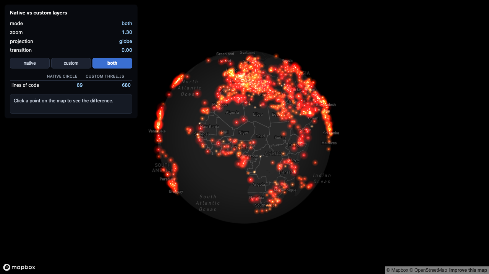

# 00-native-vs-custom

> Status: 🔬 **Reproduced** — builds clean, 23/23 unit tests, and visually verified with a real token: both layers render on the globe at identical positions, and clicking confirms the native layer answers `queryRenderedFeatures` while the custom layer does not.



The same 1,174 airports, drawn two ways on the same Mapbox globe, switchable live: a native `circle` layer, and a Three.js `CustomLayerInterface` copied from [`examples/01-points-on-globe`](../01-points-on-globe/). This is the decision-tree anchor for the whole repo: **do you actually need a custom layer?**

This example does not fix a bug the way the other recipes do — it exists to make the *cost* of "hugging the globe by hand" visible next to the thing you get for free when you don't need to.

## What it demonstrates

| | Native `circle` layer | Custom Three.js layer |
|---|---|---|
| Code to hug the globe | `map.addLayer({ type: "circle", ... })` — Mapbox projects it onto the sphere internally | [`globeProject.ts`](src/globeProject.ts) + [`glowPointsScene.ts`](src/glowPointsScene.ts) + [`glowLayer.ts`](src/glowLayer.ts) — 693 lines, hand-written ECEF math, ported from [1.1 Hugging the globe: Mapbox](../../docs/01-hugging-the-globe/mapbox.md) |
| Lines of code | 89 ([`src/nativeLayer.ts`](src/nativeLayer.ts), drawing **and** click/popup/cursor wiring) | 680 (drawing only — see "Click behavior" below for why there's no interaction code to count) |
| Hit-testing / popups | `queryRenderedFeatures` sees it — free | **Does not participate.** Structurally invisible to `queryRenderedFeatures`; see below |
| Appearance | Whatever `circle-*` paint properties support | Arbitrary GLSL — this one does additive-blended pseudo-bloom, which `circle` layers cannot |

The running example shows this live: a mode switch (`native` / `custom` / `both`), a panel with `zoom` / `projection` / `transition` readouts (see [1.1](../../docs/01-hugging-the-globe/mapbox.md) for what those mean), and a table with the line counts above.

## Click behavior — the most important part

Click a point on the map:

- **`native` mode:** a popup appears with the airport's name and ICAO ident. This is `queryRenderedFeatures` — or, here, a layer-scoped `click` listener that wraps it — finding a feature in Mapbox's own rendered buffers.
- **`custom` mode:** **nothing appears.** Not "nothing appears because you missed" — nothing appears no matter how precisely you click on a glowing dot, because `CustomLayerInterface` draws straight into the shared WebGL context with its own draw calls and never touches the feature buffers `queryRenderedFeatures` inspects. The panel reports this explicitly instead of staying silent, so it reads as "this is the point" rather than "this is broken."
- **`both` mode:** the native layer still gets the click (same popup as above) — the custom layer stacked at the exact same screen position gets nothing, regardless of hit or miss. Interaction was never a choice the custom layer got to make.

This is why `CUSTOM_LOC` above has no interaction code baked into it: there isn't any to write. The real workaround — used in production, and referenced in [1.1's "Step 5" sanity check](../../docs/01-hugging-the-globe/mapbox.md) — is to keep a second, **invisible** native `circle` layer stacked at the same coordinates purely to own hit-testing, and let the custom layer handle only the visuals. That doubles the "lines of code" story rather than closing the gap: you'd pay both the 693 lines above *and* nearly all of `nativeLayer.ts`.

## When to use which

| Use native (`circle`, `symbol`, …) when | Use a custom layer when |
|---|---|
| The look fits inside paint properties (radius, color, opacity, stroke) | You need a specific shader effect — additive glow, custom falloffs, anything paint properties can't express |
| You need clicks, hover states, or popups | Interaction can live on a **separate** native layer stacked underneath/alongside, or isn't needed at all |
| Point count is moderate (hundreds to low thousands) and Mapbox's own tiling/culling is enough | You're pushing tens of thousands of independently animated objects and need direct control over the draw call |
| You want the two lines in this README's first table's "native" column, not the ~680 | You're doing per-vertex computation (flow fields, advancing trails) that a style expression cannot express |

See [1.1 Hugging the globe: Mapbox GL JS](../../docs/01-hugging-the-globe/mapbox.md) for everything the custom column actually costs once you commit to it — the render-argument plumbing, the depth-test trap, the backface cull, all of it.

## Data: what's real and what's synthetic

- **Positions and names are real.** `public/airports.json` is the same file as `examples/01-points-on-globe/public/airports.json` — 1,174 `large_airport` rows from [OurAirports](https://ourairports.com/data/airports.csv) (public domain), unchanged.
- **Point size and color are synthetic.** OurAirports doesn't publish traffic figures, so `src/airports.ts` derives a stable, arbitrary "weight" per airport from a hash of its `ident` code and maps that to both circle radius/point size and a white→orange→red ramp. This has **no relationship to actual passenger or flight volume** — don't read anything into which airports render large or which popup you happened to click. See [`01-points-on-globe`'s README](../01-points-on-globe/README.md#data-whats-real-and-whats-synthetic) for the full synthesis writeup (identical logic, duplicated here per this repo's self-contained-examples rule).

## Running it

```bash
cd examples/00-native-vs-custom
npm install
cp .env.example .env      # then edit .env and set VITE_MAPBOX_TOKEN
npm run dev
```

Get a free token at <https://account.mapbox.com/access-tokens/>. Without one, the page shows an on-screen message instead of a blank map or a crash — it never reads any `.env` file that isn't your own, and no token is committed anywhere in this repo.

## Verifying it without a token

This example was built and verified without ever opening it in a browser (no Mapbox token was available while writing it) — see the Status line above. What *was* verified:

```bash
npx tsc --noEmit    # 0 errors
npx vitest run      # 23/23 tests pass (13 globe math + 7 GeoJSON conversion + 3 embed bridge)
npm run build        # succeeds (vite build)
```

The unit tests cover three things in isolation, without a WebGL context:

- [`src/globeProject.test.ts`](src/globeProject.test.ts) — the same globe-hugging math tests as `01-points-on-globe` (this file is copied unmodified alongside `globeProject.ts`; see "What's copied vs. new" below).
- [`src/airportsGeoJSON.test.ts`](src/airportsGeoJSON.test.ts) — the GeoJSON conversion feeding the native layer: feature count matches input, coordinate order is `[lon, lat]` (GeoJSON's order — the single most common bug when hand-building GeoJSON, since everyday speech says "lat, lon" the other way around), and every property (`ident`, `name`, `colorHex`, `sizeNorm`) survives the conversion untouched.
- [`src/embedBridge.test.ts`](src/embedBridge.test.ts) — same-origin runtime-token acceptance, iframe-local memory storage, and embedded language preferences used by the atlas shell.

Neither suite can verify that either layer actually renders correctly, that the mode switch behaves as described, or that clicking really does/doesn't produce a popup — trust your eyes over this README if you run it with a real token and something looks wrong.

## What's copied vs. new

Kept as self-contained local copies from [`examples/01-points-on-globe`](../01-points-on-globe/) (per this repo's "self-contained examples, duplication is fine" rule):

- `src/globeProject.ts`, `src/globeProject.test.ts`
- `src/glowPointsScene.ts`, adapted to the parent site's light/dark theme
- `src/glowLayer.ts`, adapted to pass that theme into the shader scene
- `public/airports.json` (same OurAirports data, same 1,174 large airports)

New for this example:

- `src/airports.ts` — same loader/synthesis logic as the original, but keeps `ident`/`name` (the original drops them) since the native layer's popup needs them
- `src/airportsGeoJSON.ts` — converts loaded airports into the GeoJSON the native `circle` layer's source consumes; deliberately uses its own minimal local types instead of the ambient `GeoJSON` namespace mapbox-gl's own `.d.ts` references (that namespace only resolves when `@types/geojson` happens to be installed somewhere upstream — it's a *devDependency* of `mapbox-gl`, not a dependency, so a fresh `npm install` of this example alone does not pull it in)
- `src/nativeLayer.ts` — the native `circle` layer plus click/popup/cursor wiring
- `src/main.ts` — mode switch, panel readouts, and the click-behavior comparison logic (not copied — the original's HUD has sliders instead of a mode switch)
- `src/embedBridge.ts` — runtime-token handshake and fail-closed memory storage isolation for the atlas iframe; standalone token handling remains unchanged
- `index.html` — same visual language as the original's HUD, restructured for the mode switch, line-count table, and click-info panel

## Deliberate simplifications

- **No glow parameter sliders.** `01-points-on-globe` exposes `sizeMul`/`opacity`/`coreBoost` as HUD sliders; this example fixes them as constants (`1`, `0.9`, `0.7`) because the point here is the mode switch, not tunable glow.
- **Custom-layer visibility is "opacity 0", not a real toggle.** `CustomLayerInterface` has no visibility flag. Switching to `native` mode drives the custom layer's `getOpacity()` control to `0` instead — zero source alpha leaves the framebuffer unchanged in both theme blending modes, at the cost of Mapbox still calling `render()` on it every frame either way (which is also *useful* here: it's why the `projection`/`transition` readout keeps updating in every mode, not just `custom`/`both`).
- **`both` mode's "which layer received this click" logic is a fixed two-branch check**, not a general N-layer picker — reasonable for a two-layer demo, not something to copy into a real app with more layers.
- **`airports.json` is fetched twice.** `glowLayer.ts`'s `onAdd` calls `loadAirports()` for the custom layer, and `main.ts`'s `load` handler calls it again for the native layer's GeoJSON — same file, same 71 KB, two `fetch()` calls (the browser cache absorbs the second one in practice). This is the direct cost of keeping `glowLayer.ts` byte-identical to the original rather than refactoring it to accept pre-loaded data.
- Every other simplification listed in [`01-points-on-globe`'s own README](../01-points-on-globe/README.md#deliberate-simplifications) (repaint throttling, single color ramp, fixed cull width, etc.) applies here too; the only scene/layer divergence here is theme handling.
