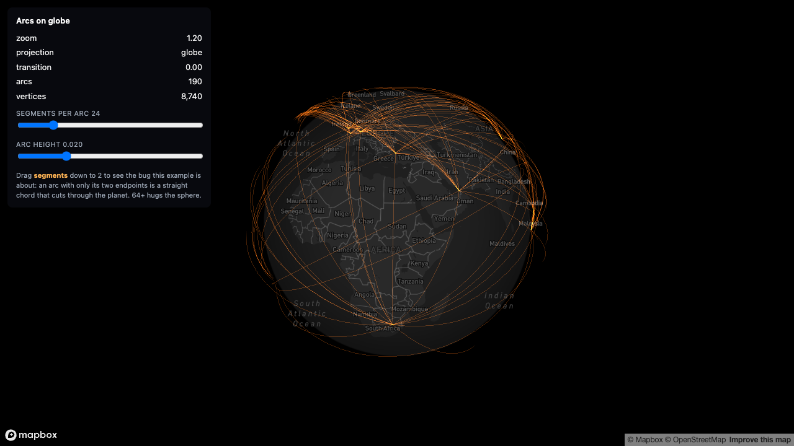

# 02-arcs-on-globe

> Status: 🔬 **Reproduced** — builds clean, 37/37 unit tests, and visually verified with a real token: 190 arcs follow the sphere at `transition` 0.00, and the far side is culled. The current 53-sample default produces 19,760 vertices.



<sup>Default 24 segments per arc. Drag the slider down to 2 and the arcs become chords straight through the planet — that failure is the point of this example.</sup>

Great-circle origin-destination arcs between 20 real airport hubs, drawn as a single `THREE.LineSegments` on a Mapbox GL JS globe, using a Three.js `CustomLayerInterface`. This is the runnable companion to [1.1 Hugging the globe: Mapbox GL JS](../../docs/01-hugging-the-globe/mapbox.md) — specifically its "One thing to fix before you start" section, which this example exists to make impossible to miss.

## The bug this example is about

> Vertices get projected; the segments between them do not.

A straight line between two points on a sphere is a **chord**, not an **arc** — no matter how correct both endpoints are, the line between them cuts through the inside of the planet. This is easy to miss with dense, naturally-subdivided data (a flight track, a GPS trace already has hundreds of points), and easy to hit hard with a synthetic origin-destination arc, which naturally starts life as exactly two points.

This example's **"segments per arc" slider** (range 2–128) makes that failure mode directly visible:

- **At 2**, an arc is its two endpoints and nothing else — one raw line segment, the straight chord, visibly cutting through the globe.
- **At 64+**, the same arc is smoothly subdivided and hugs the sphere.

Nothing in Mapbox or Three.js subdivides this for you. `arcs.ts`'s `sampleArc` is the whole fix: sample more points along the great circle before handing them to the renderer.

Root cause #2 from the parent doc — depth testing and backface culling — is also fully applied here (`depthTest: false`, ECEF-space culling, `uTransition` early-out), but it's not this example's main point; see [01-points-on-globe](../01-points-on-globe/) for that one demonstrated in isolation.

## What it demonstrates

- **The under-subdivided-arc bug**, live and adjustable (see above) — this is the reason this example exists.
- **Slerp vs. lerp for geographic interpolation** (`slerp.ts`): why interpolating (lon, lat) directly is wrong twice over, and how spherical linear interpolation in 3D unit-vector space fixes both problems for free. See "Slerp vs. lerp" below.
- **The antimeridian trap**, concretely: a Taipei → Los Angeles arc that crosses close to the date line, and the atan2 branch-cut artifact that trips up anyone diffing raw longitude values across it (`unwrapLongitude`).
- The same globe-hugging fundamentals as [01-points-on-globe](../01-points-on-globe/): reading the undocumented `render()` arguments, `depthTest: false`, ECEF-space backface culling, and the `uTransition >= 1.0` early-out — applied here to **lines** instead of point sprites, in a single `THREE.LineSegments` draw call for ~190 arcs at once.
- **Precomputing static geometry's ECEF once, on the CPU** (not deriving it in the shader) — and why that's still the right call even though this geometry's shape changes when you move the segments/height sliders. See "Why precomputed ECEF, not shader-side" below.

## Running it

```bash
cd examples/02-arcs-on-globe
npm install
cp .env.example .env      # then edit .env and set VITE_MAPBOX_TOKEN
npm run dev
```

Get a free token at <https://account.mapbox.com/access-tokens/>. Without one, the page shows an on-screen message instead of a blank map or a crash — it never reads any `.env` file that isn't your own, and no token is committed anywhere in this repo.

## Verifying it without a token

This example was built and verified without ever opening it in a browser (no Mapbox token was available while writing it):

```bash
npm install          # 111 packages, 0 vulnerabilities
npx tsc --noEmit      # 0 errors
npx vitest run        # 37/37 tests pass
npm run build          # succeeds (vite build)
```

The unit tests split across three files:

- `src/globeProject.test.ts` (13 tests) — copied verbatim from `01-points-on-globe`, unchanged; it tests the shared `globeProject.ts` module, which is also copied verbatim (see "Where the math comes from").
- `src/slerp.test.ts` (11 tests) — the spherical-interpolation math in isolation: endpoint exactness, staying on the unit sphere across a range of `t`, antipodal inputs never producing `NaN`, and `unwrapLongitude`'s antimeridian correction.
- `src/arcs.test.ts` (13 tests) — the arc-sampling, route-building and deterministic palette logic: vertex counts, the height profile, route-color variety, and a concrete Taipei → Los Angeles antimeridian case (see "Slerp vs. lerp" below) including a direct comparison against a deliberately naive lon/lat-lerp reference.

None of this verifies that the shader compiles and looks right in an actual WebGL context, or that 190 additively-blended arcs at `ARC_ALPHA = 0.28` (see `arcsScene.ts`) look good rather than either too faint or blown out at busy hubs — that alpha value is a reasoned guess, not something visually tuned. If you run this with a real token and it looks wrong, trust your eyes over this README.

## Adjustable parameters

| Control | Where | Default | Range | Effect |
|---|---|---|---|---|
| Segments per arc | HUD slider | 53 | 2–128 | Vertex count sampled along each arc's great circle — see "The bug this example is about" |
| Arc height | HUD slider | 0.028 | 0–0.08 (mercator-Z units) | Peak radial lift at each arc's midpoint |
| Arc palette | HUD select | Plasma | Spectrum / Solar / Aurora / Plasma / Ice | Stable synthetic per-route colors for visual separation; no route category or traffic meaning |
| `MAX_ARC_COUNT` | `src/arcsScene.ts` constant | 256 | — | Fixed buffer capacity in routes — raise if you add more hubs |
| `MAX_SEGMENTS_PER_ARC` | `src/arcsScene.ts` constant | 128 | — | Must match (or exceed) the segments slider's max |
| `ARC_ALPHA` | `src/arcsScene.ts` constant | 0.28 | — | Per-arc alpha; color comes from the selected palette |
| Backface cull thresholds | `smoothstep(-0.08, 0.02, d)` in `src/globeProject.ts` | fixed | — | Same as 01-points-on-globe — how wide/soft the horizon fade is |

## Data: what's real and what's synthetic

- **Airport positions are real.** `public/airports.json` is the same file, produced by the same script (`scripts/fetch-airports.mjs`), as [01-points-on-globe](../01-points-on-globe/) — see that example's README for full provenance (OurAirports, public domain, `large_airport` rows, 1,174 airports). It's copied here rather than shared, per this repo's "every example is self-contained" rule (see `examples/README.md`).
- **Which 20 airports are "hubs" is a curated pick, not a ranking.** `src/airports.ts`'s `HUB_IDENTS` was hand-picked for continent-level spread (East/Southeast Asia, the Middle East, Europe, Africa, North America, South America, Oceania) so the arcs fan out across the whole globe. OurAirports doesn't publish traffic figures — this is not a "20 busiest airports" list, and no airport's presence or absence here implies anything about how busy it actually is.
- **Arc colors are synthetic.** Each origin/destination identifier pair receives a stable hash into the selected palette. The hue only separates overlapping routes visually; it does not encode carrier, route class, traffic, risk, or another measured value.
- **The 190 arcs are not real flight routes.** `buildArcRoutes` draws every unordered pair among the 20 hubs — C(20,2) = 190 — not an actual O-D traffic dataset. Don't read "airline X flies between these two cities" into any single arc; it's "these two cities are both in the hand-picked hub list."
- **Arc height is a stylistic exaggeration, not a physical altitude.** A real airliner's cruise altitude (~10km) is about 0.16% of Earth's radius — at true scale it would be visually indistinguishable from the surface. Like essentially every flight-arc visualization, the height slider's default (and its whole range) is picked purely so arcs read clearly as arcs, not for physical accuracy.

## Slerp vs. lerp: why not just interpolate (lon, lat) directly?

It's tempting to sample an arc as `lon = lerp(lon0, lon1, t)`, same for `lat`. That's wrong in two independent ways, both demonstrated in `arcs.test.ts`:

1. **It's not a great circle.** A degree of longitude covers less real ground the further you are from the equator, so linearly blending degrees doesn't trace the shortest path over a sphere — it traces something that happens to look reasonable near the equator and gets visibly wrong elsewhere.
2. **It has no idea the antimeridian exists.** This example's Taipei (121.5°E, 25.0°N) → Los Angeles (118.2°W, 33.9°N) arc is the concrete case: the true great circle crosses the Pacific close to the date line, an angular separation of about 98.3°. A naive `lon = lerp(121.5, -118.2, t)` doesn't know that — it sweeps monotonically downward through 90°, 0°, -90°, covering **239.7°** of longitude the *long* way around, through mainland Asia, Africa, and the Atlantic, with a `t=0.5` "midpoint" near 1.65°E (Greenwich). The real midpoint of the flight sits out over the Pacific near 177°E. `arcs.test.ts`'s antimeridian suite checks exactly this: the slerp path's longitude span stays inside a ~120° corridor while a locally-defined naive-lerp reference spans roughly double that.

Slerping in 3D unit-vector space (`slerpUnitVectors` in `slerp.ts`) sidesteps both problems for free: there's no "longitude" in that space at all, so there's no antimeridian to special-case, and the interpolation is the great circle by construction (`slerp(a,b,t) = (sin((1-t)Ω)·a + sin(tΩ)·b) / sin(Ω)`, constant angular speed). Longitude only re-enters once a sampled 3D point is converted back to (lon, lat) via `atan2` for `lonLatToEcef` — and `atan2` always returns a value in (-180°, 180°], so a path that crosses the antimeridian shows a **~355° jump** between two samples that are geographically only a few degrees apart. That's a coordinate *representation* artifact (a branch cut), not a geometry error — the underlying 3D point moved continuously the whole way. `sampleArc` fixes the representation with `unwrapLongitude`, which adds/subtracts whole turns so the returned sequence stays continuous; this is purely cosmetic for rendering (`lonLatToEcef`'s `sin`/`cos` are 360°-periodic, so 181.9° and -178.1° produce an *identical* ECEF point) but it's what makes the raw waypoint sequence — and this example's own tests — well-behaved.

## The antimeridian's second trap: the flat-mercator fallback

The unwrap described above fixes the *globe* rendering path (ECEF is 360°-periodic, so it doesn't even need fixing, strictly speaking) and the raw waypoint sequence. It does **not**, by itself, fix the *flat*-mercator fallback path (`uTransition >= 1`, i.e. once you're zoomed in past the globe threshold): `mapboxgl.MercatorCoordinate.fromLngLat`'s underlying formula, `x = (180 + lng) / 360`, is not periodic — wrapping each of an antimeridian-crossing arc's samples independently back into (-180°, 180°] puts the two endpoints of the ONE segment that actually crosses the date line on opposite edges of mercator space (x ≈ 0.99 and x ≈ 0.01), which `THREE.LineSegments` then draws as a straight line spanning nearly the entire flat map — the antimeridian equivalent of the exact bug this example is about, just triggered by coordinate wraparound instead of insufficient subdivision.

`arcsScene.ts`'s `rebuildGeometry` fixes this by resolving each line **segment**'s pair of mercator longitudes together rather than independently: the first vertex wraps normally, and the second is anchored to it (`lon1 = lon0 + (s1.lon - s0.lon)`), using the small, true angular step `sampleArc`'s continuous output already guarantees. That lets the crossing segment's second vertex land a hair outside the canonical (-180°, 180°] range (e.g. ~181.9°) — which `mapboxgl.LngLat` accepts by design; its own docs construct one from a longitude of 286.0251° and only normalize it on request via a separate `.wrap()` method (confirmed by reading `node_modules/mapbox-gl/dist/mapbox-gl.d.ts` directly, and by finding Mapbox's own internal `mercatorXfromLng` GLSL — `(180.0+lng)/360.0`, no wraparound — embedded in the same bundle).

**This fix is verified by reading Mapbox's own source and documented behavior, not by rendering it** — no token was available (see the Status line). If you run this with a real token, zoom into one of the ~30-40 arcs connecting an East/Southeast Asian hub to a North American west-coast one (these are the ones whose great circle passes near 180° longitude) at high zoom, and it draws a stray line across most of the map, that's the thing to check first.

## Where the math comes from

`src/globeProject.ts` is copied **verbatim, unchanged** from [01-points-on-globe](../01-points-on-globe/src/globeProject.ts) — same `GLOBE_PROJECT_GLSL` string, same `lonLatToEcef`/`mercatorToGlobe` functions, same test file. See that example's README for where each piece of that math comes from; this example only adds `slerp.ts` (great-circle sampling, described above) and `arcs.ts` (turning hub pairs into sampled arc geometry) on top of it.

## Why precomputed ECEF, not shader-side

`globeProject.ts`'s Step 1 offers two paths: precompute each vertex's ECEF position once on the CPU (for geometry that stays put), or derive it in the shader every frame from a moving mercator coordinate (for geometry that doesn't — flow-field particles, an advancing trail). This example's arcs are firmly in the first camp: given a fixed origin, destination, segment count, and height, an arc's shape never changes frame to frame, so recomputing its ECEF every frame in the shader would pay `sin`/`cos`/`atan2` costs the recipe explicitly says to avoid, for zero benefit.

The one wrinkle: `segmentsPerArc` and `arcHeight` are **live sliders**, so "never changes" isn't quite "never recomputed." `ArcsScene.setParams` reruns `sampleArc` for all ~190 routes — up to a few hundred thousand trig calls — every time either slider's value actually changes (it no-ops otherwise; see its docstring). That's a world away from "every vertex, every frame": it's sub-millisecond-scale and only runs on a slider drag, not inside the render loop. A more elaborate version would separate "resample the great-circle path geographically" (truly needs to happen only once per route, ever) from "recompute height and re-derive ECEF/mercator from it" (needs to happen on every `arcHeight` change) so a height-only change wouldn't re-run the slerp itself — see "Deliberate simplifications" below for why this example doesn't bother.

## Deliberate simplifications

Compared to a more complete version of this technique, this example leaves out:

- **A smarter geometry/height split.** As described above, this example fully re-samples every arc's great-circle path whenever segments *or* height changes, even though only height actually needs `arcHeight`'s current value — the geographic path itself never changes once a route is picked. Splitting these would avoid redundant slerp calls on a pure height-slider drag, at the cost of a second precomputed buffer and more state to keep in sync. Skipped for readability; the redundant work is fast enough not to matter at this scale (~190 arcs).
- **Tunable opacity.** The palette is adjustable and colors are per-route, but `ARC_ALPHA` remains a fixed constant chosen to keep converging additive arcs from blowing out. A production version would likely expose opacity too and could replace the synthetic hue with an explicitly documented real variable.
- **Real line width.** `THREE.LineSegments` here uses raw `GL_LINES`, which most browsers/GPUs render at a fixed ~1px regardless of any `linewidth` you set — this example doesn't fight that. A version wanting visibly thicker arcs would need a triangle-strip "ribbon" approach instead, which is a materially bigger undertaking than this example's scope.
- **Repaint throttling.** Same simplification `glowLayer.ts` documents in 01-points-on-globe: `arcLayer.ts` calls `map.triggerRepaint()` unconditionally every frame so slider changes show up immediately with no extra event wiring. Production code throttles this via a shared scheduler across layers. Don't copy the "always repaint" line into something with a real GPU budget.
- **Popups / hit-testing.** Same as 01-points-on-globe: custom layers don't participate in `queryRenderedFeatures`. This example has no interactivity beyond the two sliders.
- **A "which airports are real hubs" dataset.** As covered under "Data" above, both the hub list and the O-D pairs are curated/synthetic, not sourced from an actual traffic dataset. A production version drawing real routes would need one.
