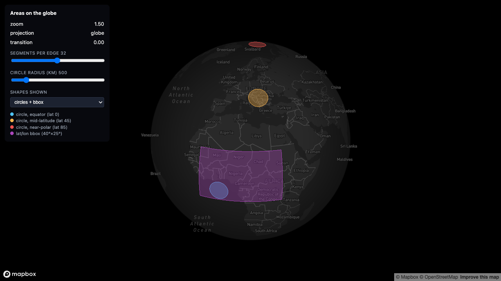

# 03-areas-on-globe

> Status: 🔬 **Reproduced** — builds clean, 15/15 unit tests on the boundary maths, and visually verified with a real token: three 500 km circles and a subdivided bbox sit on the sphere.



<sup>All three circles have the same 500 km radius. The near-polar one (red, by Svalbard) is visibly a flattened ellipse — a circle on a sphere is not a circle on your screen.</sup>

Filled polygons and geodesic circles that hug Mapbox GL JS's globe projection, using a Three.js `CustomLayerInterface`. This is the runnable companion to [1.1 Hugging the globe: Mapbox GL JS](../../docs/01-hugging-the-globe/mapbox.md) -- same recipe as [`01-points-on-globe`](../01-points-on-globe/), applied to *areas* instead of points, which raises two problems points never have:

1. **Edges, not just vertices, need to hug the sphere.** A polygon edge between two correctly-projected vertices is still a straight chord that cuts into the globe unless you add intermediate points along it.
2. **A fixed real-world radius is not a fixed screen radius.** A "500km circle" traced by *true* spherical geometry looks like a completely different size and shape depending on how close to a pole it sits -- and it is not the same shape as "add 500km worth of degrees to a center point," which isn't a coherent notion of distance on a sphere at all.

## What it demonstrates

- **`geodesicCircle()`** (`src/shapes.ts`) -- generates a circle's boundary using the standard sphere "destination point given distance and bearing" formula, so every boundary point is genuinely `radiusKm` of great-circle distance from the center. Not an ellipse approximation, not a flat-degrees offset.
- **`bboxOutline()`** (`src/shapes.ts`) -- subdivides a lat/lon bounding box's four edges into N points each. At `segmentsPerEdge = 1` this is exactly the four corners: the "undivided box" the recipe doc warns about, whose edges are straight chords in lon/lat space.
- A **segments slider** shared by both generators: drag it to the minimum and every shape's edges visibly cut into the globe; raise it and they hug the sphere. Same lesson as the arc examples upstream in this repo, applied to closed shapes instead of open paths.
- **Fan triangulation** (`triangulateFan()`) for the fill mesh -- the simplest triangulation that's exactly correct for any convex polygon, with no added dependency. See "Deliberate simplifications" for what this rules out.
- **Three circles, one radius, three latitudes** -- the same `radiusKm` value drawn at the equator, mid-latitude, and near a pole, side by side. This is the example's headline shot: identical spherical geometry, wildly different screen footprint.
- **Fill + outline as plain Three.js materials** (`MeshBasicMaterial` + `LineLoop`/`LineBasicMaterial`), not a custom shader -- see the architectural note below.
- The same **ECEF backface culling** as the recipe doc, done per boundary vertex, written into vertex-color alpha rather than a fragment shader varying.

### Architectural note: CPU-side hugging, not a GPU shader

`01-points-on-globe` does the sphere<->flat blend and the backface cull **on the GPU**, in `GLOBE_PROJECT_GLSL` -- the right call when you're redrawing thousands of points every frame. This example instead calls `mercatorToGlobe()` -- the plain JS half of the exact same math, from the exact same `globeProject.ts` -- **on the CPU**, once per boundary vertex per frame, and writes the result straight into standard `THREE.MeshBasicMaterial` / `THREE.LineBasicMaterial` geometry attributes. No custom vertex or fragment shader anywhere in this file.

That trade only makes sense because this example's vertex counts are tiny (a few hundred, not thousands): the point of *this* example is subdivision and triangulation, not shader tricks, so keeping the render path to plain materials keeps the spotlight there. Per-vertex culling still works without a fragment shader, via a real (if easy to miss) Three.js feature: give a `color` `BufferAttribute` `itemSize = 4` instead of `3`, and Three.js defines `USE_COLOR_ALPHA` and multiplies the vertex color's alpha into the material automatically -- see `vertexAlphas` in `node_modules/three/build/three.module.js`. No `onBeforeCompile` required.

`globeProject.ts` in this example is byte-for-byte the same file as in `01-points-on-globe` -- this repo's examples deliberately don't share code across folders (see `examples/README.md`), so it's copied, not imported from a sibling package.

## Running it

```bash
cd examples/03-areas-on-globe
npm install
cp .env.example .env      # then edit .env and set VITE_MAPBOX_TOKEN
npm run dev
```

Get a free token at <https://account.mapbox.com/access-tokens/>. Without one, the page shows an on-screen message instead of a blank map or a crash -- it never reads any `.env` file that isn't your own, and no token is committed anywhere in this repo.

## Verifying it without a token

This example was built and verified without ever opening it in a browser (no Mapbox token was available while writing it) -- see the Status line above. What *was* verified:

```bash
npm install          # 0 vulnerabilities
npx tsc --noEmit      # 0 errors
npx vitest run        # 15/15 tests pass
npm run build         # succeeds (vite build)
```

The unit tests (`src/shapes.test.ts`) cover `geodesicCircle()` and `bboxOutline()` in isolation -- no WebGL context, no Mapbox instance, no Three.js import at all:

- Every `geodesicCircle()` boundary point is checked against an **independently written** great-circle distance (haversine) -- deliberately not sharing a formula with the generator under test, so a shared sign error couldn't pass both. Covers the equator, both hemispheres, near the antimeridian, and near a pole (both a circle that stays clear of the pole and one large enough to enclose it).
- Boundary point counts: `geodesicCircle(..., segments)` returns exactly `segments` points; `bboxOutline(..., segmentsPerEdge)` returns exactly `4 * segmentsPerEdge`, with `segmentsPerEdge = 1` checked to be exactly the four corners in order.
- A near-pole circle (center lat 85) produces no `NaN` at three radii that bracket the "exactly at the pole" boundary, where `asin()` clamping matters most; a circle known to enclose the pole is checked to actually produce a boundary point on the far meridian (~180 degrees from the center's longitude), which is correct geometry, not a bug, once radius exceeds distance-to-pole.
- Every generated boundary point, converted to ECEF via the (copied, untouched) `globeProject.ts`, has equal vector length -- i.e. actually lands on the sphere.
- `triangulateFan()` is checked against small n by hand: index count, pivot-at-0, and index range.

They do not, and cannot, verify that the fill/outline actually render correctly in a WebGL context -- that both materials pick up per-vertex alpha, that `depthTest: false` behaves as expected against a real globe, or what the three-latitudes comparison actually looks like. If you run this with a real token and something looks wrong, trust your eyes over this README.

## Adjustable parameters

| Control | Where | Default | Effect |
|---|---|---|---|
| Segments per edge | HUD slider `#segments` | 6 (range 1–64) | Passed to both `geodesicCircle()` and `bboxOutline()`. At 1, `bboxOutline` returns the raw 4-corner quad (max chord-cutting); a circle needs at least 3 to be a triangle at all. |
| Circle radius (km) | HUD slider `#radius-km` | 500 (range 100–3000) | `radiusKm` passed to all three demo circles (equator / mid-lat / polar) -- kept identical across all three on purpose, so the only variable between them is latitude. |
| Shapes shown | HUD select `#shape-mode` | `both` | Toggles `circleGroup` / `bboxGroup` visibility in `areasScene.ts` -- no rebuild, just `.visible`. |
| `FILL_ALPHA` / `OUTLINE_ALPHA` | `src/areasScene.ts` constants | 0.35 / 0.9 | Base alpha before the per-vertex `cull` factor is multiplied in. |
| Demo shape centers/colors/bbox extent | `CIRCLE_DEFS` / `BBOX_DEFS` in `src/areasScene.ts` | equator/mid-lat/polar circles, one 40°×25° box | Circle *center* is a `geodesicCircle()` parameter (see below) but isn't exposed as a live control -- see "Deliberate simplifications." |
| Backface cull thresholds | `smoothstep(-0.08, 0.02, d)` inside `mercatorToGlobe()` in `src/globeProject.ts` | fixed | Same knob as `01-points-on-globe`; unchanged here. |

## Where the math comes from

`src/shapes.ts` holds the two boundary generators, in plain lon/lat degrees -- it has no dependency on Mapbox, mercator, or ECEF, which is what makes it unit-testable with plain numbers. `src/globeProject.ts` (copied unmodified from `01-points-on-globe`) is what turns those lon/lat points into the globe-hugging blend; see [the recipe doc](../../docs/01-hugging-the-globe/mapbox.md) for that half.

- **Geodesic circle** ("destination point given distance and bearing," the same formula behind most great-circle calculators):
  `phi2 = asin(sin(phi1)*cos(delta) + cos(phi1)*sin(delta)*cos(theta))`,
  `lambda2 = lambda1 + atan2(sin(theta)*sin(delta)*cos(phi1), cos(delta) - sin(phi1)*sin(phi2))`,
  where `delta = radiusKm / 6371` is the angular radius and `theta` sweeps `0..2*PI` across `segments` points.
- **Lat/lon bbox**: each of the four edges (south/east/north/west) is linearly interpolated in lon/lat between its two corners, `segmentsPerEdge` points per edge, corners not duplicated.
- **Fan triangulation**: triangles `(0, i, i+1)` for `i = 1..n-2` -- correct for any convex polygon, which both generators above always produce (see limitations below).

## Deliberate simplifications

Compared to a production "coverage area" or "service radius" layer, this example leaves out:

- **Concave polygons and holes.** `triangulateFan()` is only correct for convex shapes. A real service-area polygon with a notch cut out of it, or a multi-ring shape (area with a hole), needs ear-clipping (e.g. the `earcut` library) or a constrained triangulator -- out of scope for this repo's example dependency budget (`mapbox-gl` + `three`, nothing else; see `CONTRIBUTING.md`).
- **Bounding boxes across the antimeridian.** `bboxOutline()` does not detect or special-case `sw.lon = 170, ne.lon = -170` -- it linearly interpolates straight through 0, spanning 340 degrees the wrong way instead of 20. `geodesicCircle()` does not share this limitation (it works in bearing/distance, never in raw longitude differences), which is part of why the antimeridian test in `shapes.test.ts` only exercises the circle generator.
- **Circles that enclose a pole, drawn as a filled mesh.** `geodesicCircle()` itself handles this correctly as a boundary (see the pole-enclosing unit test), but `triangulateFan()` assumes the boundary is a single simple loop around a well-defined "inside" -- a pole-enclosing circle's fan triangulation would self-intersect near the far meridian. None of this example's three demo circles are large enough at their latitudes to trigger this; it isn't guarded against in code.
- **A live "circle center" control.** `geodesicCircle(center, radiusKm, segments)` accepts an arbitrary center -- proven by the three demo circles using three different ones -- but the HUD only exposes `radiusKm` and `segments` as sliders. Three independent center-position sliders (or a click-to-place UI) would compete with, rather than support, the one comparison this example is built around: same radius, three fixed latitudes, side by side.
- **Repaint throttling / forced continuous repaints.** Unlike `01-points-on-globe` (which animates a size pulse and so must force a repaint every frame), these shapes are static once drawn -- `areasLayer.ts` does not call `map.triggerRepaint()` from inside `render()` at all. Camera moves already trigger their own repaints via Mapbox; slider changes trigger one explicitly from `main.ts`.
- **Popups / hit-testing.** Same limitation as `01-points-on-globe`: custom layers don't participate in `queryRenderedFeatures`. A production layer would keep an invisible native `fill`/`line` layer alongside this one for interaction.
- **A geodesy-accurate Earth radius.** `EARTH_RADIUS_KM = 6371` (mean spherical radius) is used for all great-circle math in `shapes.ts`. This is not the WGS84 ellipsoid, and is a completely different number from `GLOBE_RADIUS` in `globeProject.ts` (Mapbox's internal, unitless ~1303.797) -- see `shapes.ts`'s module docstring for why the two must never be confused.
