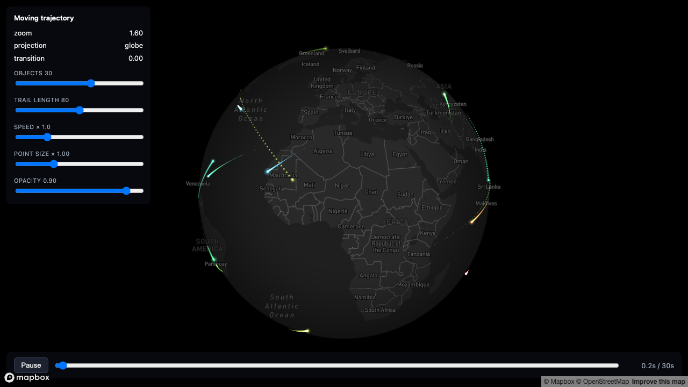

# 04-moving-trajectory

> Status: 🔬 **Reproduced** — builds clean, 41/41 unit tests, and visually verified with a real token: 30 objects move along great-circle paths with fading trails, all hugging the sphere, with the far side culled.



Up to 50 objects animate along great-circle routes, each with a glowing head and a fading ring-buffer trail, hugging Mapbox's globe projection and scrubbable both forward and backward through a 30-second loop. This is the runnable companion to [1.1 Hugging the globe: Mapbox GL JS](../../docs/01-hugging-the-globe/mapbox.md) — specifically its **"Unless your geometry moves — then do it in the shader"** section, which [`01-points-on-globe`](../01-points-on-globe/) (this cookbook's first example) doesn't exercise at all, because its airports never move.

## What it demonstrates

- The recipe's second Step-1 branch: deriving ECEF from a mercator coordinate **inside the vertex shader, every frame**, instead of precomputing it once as a vertex attribute. Every vertex in this example (both the moving head points and the frozen trail points) goes through this branch — see the comparison table below for why that's a deliberate simplification, not an oversight.
- A per-object ring-buffer trail, updated with `BufferAttribute.needsUpdate` + `addUpdateRange` **partial** uploads — not a full geometry rebuild — during normal playback, and why a scrub-triggered rebuild is bounded to just the active objects' blocks, never the whole fixed-capacity buffer.
- One deterministic position function (`objectPositionAtSimTime`) driving both the moving head and the trail sampling, which is what makes dragging the scrubber **backward** produce a correct, reproducible trail instead of undefined behavior.
- A ping-pong loop whose per-object phase is engineered (integer cycle counts, `mod1`) to wrap from 100% back to 0% with **zero visible teleport** — most naive "loop the animation" implementations get this wrong.
- The same depth/blend/frustum discipline as the static example (`depthTest: false`, `AdditiveBlending`, `frustumCulled = false` + infinite bounding sphere, `autoClear = false`, `resetState()` before and after) — carried over verbatim, because none of it is specific to whether the geometry moves.

## Running it

```bash
cd examples/04-moving-trajectory
npm install
cp .env.example .env      # then edit .env and set VITE_MAPBOX_TOKEN
npm run dev
```

Get a free token at <https://account.mapbox.com/access-tokens/>. Without one, the page shows an on-screen message instead of a blank map or a crash — verified in a real browser during development (see Status above) — and no token is committed anywhere in this repo, nor did building this example ever read the developer's own `.env` file.

## Verifying it without a token

```bash
npm install
npx tsc --noEmit    # 0 errors
npx vitest run      # 41/41 tests pass
npm run build        # succeeds (vite build)
```

The unit tests are spread across four pure modules (`src/globeProject.ts`, `src/greatCircle.ts`, `src/trailRingBuffer.ts`, `src/objectPath.ts`), none of which import `three` or `mapbox-gl` — they run under Node with no WebGL and no DOM. What they verify:

- **Inverse-Mercator round trip** (`globeProject.test.ts`): lon/lat → forward Mercator → the exact formula `GLOBE_PROJECT_MOVING_GLSL` uses in the shader, transcribed into JS with the same operation order (`mercatorYToLatRad`) → back to lon/lat, recovering latitude to 9 decimal places across `[-85, 85]` deg (longitude, being linear, round-trips exactly). This is the core correctness claim of this example and the test most worth reading if you're auditing it.
- **ECEF vector length** = `GLOBE_RADIUS` for every derived point, including near-pole samples.
- **Ring buffer semantics** (`trailRingBuffer.test.ts`): pushing past capacity overwrites the oldest slot and never the newest; each slot's position and tick stay paired (no mixing between two different writes); negative ticks (which the scrub-rebuild path produces) land in distinct slots without colliding.
- **Scrubber determinism** (`objectPath.test.ts`): the same simulation time always returns the same object position, regardless of what other times were queried first — including a "play forward, then scrub back" sequence.
- **Rebuild ≡ incremental playback** (`objectPath.test.ts`): the strongest test in the suite. It builds one trail by incrementally advancing through ~185 small, frame-rate-independent time steps, and another by directly jumping to the final time in one rebuild call, then asserts the two ring buffers are **slot-for-slot identical**. This is the property that makes "scrub back, then resume playing" seamless.
- **Slerp path sampling** (`greatCircle.test.ts`): the first and last dense samples of a route match its start/end points exactly; an antimeridian-crossing route (Tokyo → Los Angeles) produces no discontinuity in consecutive samples, which a naive lon/lat-lerp implementation would.

None of this proves the shader compiles or looks right in an actual WebGL context — see Status above.

## Static attribute vs. shader-derived ECEF

| | Static (`01-points-on-globe`) | Moving (this example) |
|---|---|---|
| Where ECEF comes from | CPU, once, at buffer-build time — stored as a vertex attribute | Vertex shader, from the mercator `position` attribute, every frame |
| What triggers a recompute | Never, after the initial load | Every frame the globe transition is active (`uTransition < 1.0`) |
| Cost | Paid once per point, ever | 4 distinct transcendental *kinds* (atan, exp, sin, cos) per vertex per frame — 6 actual calls, since sin/cos each run twice (latitude and longitude) |
| Applies to | Geometry with a fixed lon/lat: airports, stations, fixed routes | Geometry with no fixed position to precompute against: this example's head points (move continuously) and, by choice, its trail points too (see "Deliberate simplifications" — trail points are technically static once written, but reproject every frame anyway for one shared code path) |
| Downstream (mix, cull, early-out) | Identical function (`mercatorToGlobe` / `globeWorldPosition`) either way — see [the recipe doc](../../docs/01-hugging-the-globe/mapbox.md) |

See [`docs/01-hugging-the-globe/mapbox.md`](../../docs/01-hugging-the-globe/mapbox.md), section "Unless your geometry moves — then do it in the shader", for the full explanation this table summarizes.

## Adjustable parameters

| Control | Where | Default | Effect |
|---|---|---|---|
| Objects | HUD slider | 30 (range 1–50) | Active object count — only changes `setDrawRange` on both meshes, never reallocates a buffer (see below) |
| Trail length | HUD slider | 80 (range 10–150) | `uTrailWindow` — the fade-out window, in samples, NOT the physical buffer size (see below) |
| Speed × | HUD slider | 1.0 (range 0.1–4) | Multiplies wall-clock time into simulation time |
| Point size × | HUD slider | 1.0 (range 0.2–3) | `uSizeMul` on both meshes |
| Opacity | HUD slider | 0.9 (range 0.1–1) | `uOpacity` on both meshes |
| Play / Pause | transport button | playing | Freezes `getSimTime()`'s wall-clock advance |
| Scrubber | transport slider | 0% | Jumps simulation time directly to a point in the 30s loop — see "Deterministic scrubbing" below |
| `TRAIL_CAPACITY` | `trajectoryScene.ts` constant | 150 | Physical ring-buffer capacity per object — the trail-length slider's ceiling |
| `TRAIL_SAMPLE_INTERVAL_SEC` | `objectPath.ts` constant | 0.05 (20/sec) | How often a new trail sample is captured, in simulation seconds — independent of the browser's actual frame rate |
| `TIMELINE_DURATION_SEC` | `objectPath.ts` constant | 30 | Length of one scrubber loop (0–100%) |
| `MAX_OBJECTS` | `objectPath.ts` constant | 50 | Fixed head-buffer capacity — the objects slider's ceiling |

### Why the sliders never touch the buffer

Both fixed-capacity buffers (`MAX_OBJECTS` head points, `MAX_OBJECTS * TRAIL_CAPACITY` trail points) are allocated once, in `TrajectoryScene.init()`, and never resized:

- **Objects** just changes `geometry.setDrawRange(...)` on both meshes — increasing it draws more of an already-allocated buffer; decreasing it stops drawing the tail end. The underlying data for inactive slots is simply not visited.
- **Trail length** just changes the `uTrailWindow` uniform, which the fragment shader uses purely as a fade-out threshold against each vertex's age (`uCurrentTick - aTick`). The physical ring buffer capacity (`TRAIL_CAPACITY = 150`) never changes — a shorter trail length just means points older than the window fade to alpha 0 sooner, while the buffer underneath keeps recording the same history either way.

Neither slider triggers a single `BufferAttribute` reallocation or a full re-upload.

### The partial-update trap

`TrajectoryScene.syncTime()` calls `attr.addUpdateRange(...)` for just the vertices that changed, then `attr.needsUpdate = true` — **but only if at least one `addUpdateRange` call actually happened that frame.** Three's `WebGLAttributes` uploader (`node_modules/three/src/renderers/webgl/WebGLAttributes.js`) falls back to a full `bufferSubData` of the **entire** array whenever `needsUpdate` is set but `updateRanges` is empty. Setting `needsUpdate = true` unconditionally every frame "just to be safe" would silently re-upload the whole fixed-capacity trail buffer 60 times a second even while paused — exactly the cost this technique exists to avoid. `syncTime()` tracks a `trailTouched` flag through its per-object loop specifically to avoid this.

### Deterministic scrubbing

`objectPositionAtSimTime(obj, t)` is a pure function: given the same `t`, it always returns the same lon/lat, with no dependency on what time was requested before it. Dragging the scrubber backward just calls it with a smaller `t` — there's no velocity state, no integrator, nothing to "unwind". The trail ring buffer follows the same rule one level up: `syncTrailToTick` either pushes the handful of ticks crossed since the last sync (normal forward playback) or, when the jump is backward or bigger than the buffer, resets and rebuilds the trailing window ending at the new tick — and because a ring buffer slot's contents are a pure function of `tick mod capacity`, both code paths converge on bit-identical buffer state for the same final tick (see the "Rebuild ≡ incremental playback" test above).

## Where the math comes from, and three things it changes about the doc

`src/globeProject.ts` mirrors [`docs/01-hugging-the-globe/mapbox.md`](../../docs/01-hugging-the-globe/mapbox.md)'s "Unless your geometry moves" snippet as closely as possible — the `ecefFromMercator` GLSL function is the doc's four lines, unmodified. Three things came up while writing this that are worth fixing in the doc itself:

1. **The snippet uses `PI` without defining it.** GLSL has no built-in `PI` constant (unlike, say, `gl_MaxVertexAttribs`). This example's `GLOBE_PROJECT_MOVING_GLSL` adds `const float PI = 3.141592653589793;` — required, not optional; the doc's snippet won't compile as written.
2. **"Four transcendentals per vertex per frame" undercounts the literal call count.** The snippet calls `atan`, `exp`, `cos`, and `sin` — four distinct *kinds* — but `sin`/`cos` are each evaluated twice (once for latitude via `cosLat`/the `-sin(latRad)` term, once for longitude via `sin(lngRad)`/`cos(lngRad)`), so it's six actual transcendental function calls, not four. The doc's framing ("four transcendentals... the per-frame cost is real but bounded") is still directionally right, just worth a precise count if you're budgeting a GPU frame.
3. **Altitude is mentioned but not shown.** The snippet's comment says "add a radial factor if you need altitude" without saying how — Step 1's `hEcef = mercatorZ * 8192 * cos(latitude)` (from the *precomputed* branch) is the missing piece; this example doesn't need altitude (every object stays surface-bound) so it isn't exercised here, but a reader porting this to something with altitude would otherwise have to reverse-engineer it from the other branch.

The round-trip test (`globeProject.test.ts`) confirms the y-orientation convention (`y=0` at the north edge) matches what `mapboxgl.MercatorCoordinate` produces, within the ±85° range this example actually samples routes from — it passes, so that convention is confirmed consistent between the doc's snippet and Mapbox's own coordinate space.

## Deliberate simplifications

Compared to what a production version of this pattern would do:

- **Points, not connected line strips, for trails.** Rendering each trail as a `THREE.Points` cloud with per-vertex age-fade sidesteps an entire category of bug: a `THREE.Line` draws one connected strip, so packing many trails into one shared buffer needs "guard vertices" at each slot boundary (invisible, zero-length segments) to stop one trail's last point from visually bridging to the next trail's first point. See [`docs/03-scaling-up/batched-trails.md`](../../docs/03-scaling-up/batched-trails.md), "Step 2: guard vertices", for the real technique. This example never needs it, at the cost of trails that are dotted rather than continuous lines.
- **Trail vertices reproject through the moving-geometry shader branch every frame, even though they're frozen the instant they're written.** A trail sample's lon/lat never changes again once it's in the ring buffer — it could, in principle, get its ECEF computed once at write time (the *precomputed* branch, same as the static example's airports) and never touch the shader's inverse-Mercator math again. This example intentionally doesn't do that split, so the head mesh and trail mesh can share one shader source and one mental model. See [`docs/03-scaling-up/batched-trails.md`](../../docs/03-scaling-up/batched-trails.md), "Step 4: precompute what doesn't move", for the production version of exactly this optimization.
- **No eviction policy.** Object count is fixed at `MAX_OBJECTS` allocation time; the "objects" slider only changes how many of those pre-generated objects are drawn, it never creates or destroys one. A production layer with an unbounded, fluctuating population (e.g. "every flight in the air right now") needs the min-heap eviction scheme in `batched-trails.md`'s "Step 5" — this example's fixed population never needs it.
- **A single soft-circle fragment shader for trail points, vs. the head's three-ring pseudo-bloom.** The trail draw call can have up to `MAX_OBJECTS * TRAIL_CAPACITY` (7,500) vertices against the head's `MAX_OBJECTS` (50); a cheaper fragment shader for the much larger draw call is a deliberate trade, not an oversight.
- **No popups or hit-testing**, same as the static example — custom layers don't participate in `queryRenderedFeatures`.
- **Repaint throttling.** `trajectoryLayer.ts` calls `map.triggerRepaint()` unconditionally every frame, same simplification as the static example — and here it also happens to be what keeps the simulation clock advancing, since `getSimTime()` is pull-based and only ticks forward when called. Don't copy the "always repaint" line into something with a real GPU budget.
- **Routes are synthetic and procedurally generated**, not real flight/vessel/vehicle data — `generateObjectPaths()` (`src/objectPath.ts`) picks 50 deterministic (seeded) start points uniformly on the sphere and a destination 20–150° away by bearing, so re-running this example always produces the same 50 routes. No external data file, no network fetch.

## Source

The globe-hugging math is the same technique as [`01-points-on-globe`](../01-points-on-globe/), extended per [`docs/01-hugging-the-globe/mapbox.md`](../../docs/01-hugging-the-globe/mapbox.md)'s moving-geometry section. The ring-buffer trail update pattern is a small-scale version of [`docs/03-scaling-up/batched-trails.md`](../../docs/03-scaling-up/batched-trails.md)'s production technique — see "Deliberate simplifications" above for exactly what's cut.
