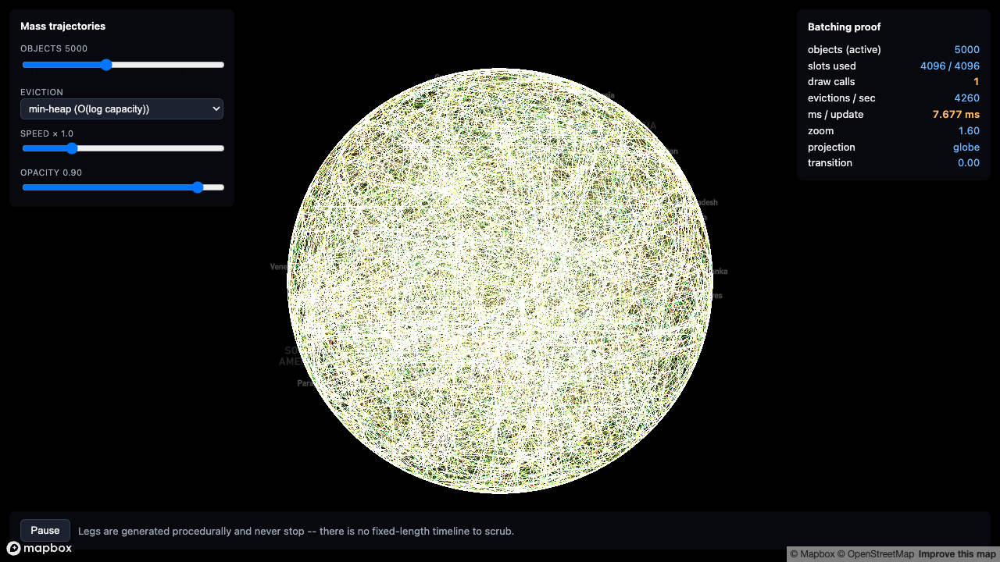

# 05-mass-trajectories

> Status: 🔬 **Reproduced** — builds clean, 57/57 unit tests, and verified in a browser with a real token at 5,000 objects.



### The batching claim, measured in a browser

Read off the running example at 5,000 objects against a 4,096-slot pool:

| | |
|---|---|
| objects (active) | 5,000 |
| slots used | 4,096 / 4,096 |
| **draw calls** | **1** |
| evictions / sec | ~8,800 |

And the eviction strategy, switched live on the same machine and the same scene:

| Strategy | ms / update |
|---|---|
| **min-heap** — O(log capacity) | **6.31 ms** |
| linear scan — O(capacity) | 22.24 ms |

About 3.5x, in the browser, on a whole frame's work. A Node micro-benchmark of the eviction step alone, at 3,000 objects against 1,024 slots, shows ~16.5x (16.81 ms versus 277.92 ms per call) — the browser figure is smaller because everything else in the frame dilutes it. Run both yourself; the numbers that matter are the ones from your machine.

_(Screenshot pending — see Status above.)_

Thousands of independently-moving, flight-like trails, batched into a **single `THREE.Line` draw call**, on Mapbox's globe. This is the runnable companion to [3.1 Batched trails](../../docs/03-scaling-up/batched-trails.md) — until now a "📋 Reported, not yet reproduced" doc in this cookbook — combined with [1.1 Hugging the globe: Mapbox GL JS](../../docs/01-hugging-the-globe/mapbox.md)'s two ECEF branches used **together, per vertex, in the same draw call**, which no other example here does.

[`04-moving-trajectory`](../04-moving-trajectory/)'s own README says it outright: "No eviction policy... a production layer with an unbounded, fluctuating population... needs the min-heap eviction scheme in `batched-trails.md`'s Step 5." This example is that next step.

## What it demonstrates

- **One `THREE.Line`, fixed slots, draw calls always 1** — regardless of whether "objects" is 500 or 12,000. Every trail gets a fixed-size slot in one shared buffer instead of its own geometry.
- **Guard vertices** isolating each slot's line strip from its neighbours — an invisible (`opacity=0`), zero-length segment at each slot boundary, so one trail's last point never visually bridges into the next trail's first point.
- **Partial buffer uploads.** Writing a trail only touches its own slot; once per frame, every touched slot's range is merged into a single contiguous span and pushed with `BufferAttribute.addUpdateRange` — never a full re-upload of the whole fixed-capacity buffer.
- **A hybrid, per-vertex ECEF split**, combining both branches `mapbox.md` documents in the SAME shader, selected by an `aDynamic` attribute: interior ("history") trail vertices read a precomputed `aEcef` attribute (Step 1, computed once when their leg was generated); head/tail vertices — freshly interpolated every frame — derive ECEF from their mercator position live, in the vertex shader ("Unless your geometry moves"). See "Where this differs from the source" below — this is NOT how the production source does it, and that's a deliberate, reportable change.
- **A binary min-heap for eviction**, keyed on each trail's own natural end time, replacing an O(capacity) linear scan for "which slot is closest to finishing anyway" — with a toggle in the HUD so you can measure the difference yourself, on your own machine, instead of trusting a number from someone else's.
- **Antimeridian-safe batched line rendering.** Unlike `04` (a `THREE.Points` cloud, which never draws a segment between two points), this example draws real connected lines through a shared buffer, so a leg crossing ±180° needs longitude resolved per-segment, not per-vertex — see `leg.ts`'s docstring and `mapbox.md`'s own antimeridian section.

## Running it

```bash
cd examples/05-mass-trajectories
npm install
cp .env.example .env      # then edit .env and set VITE_MAPBOX_TOKEN
npm run dev
```

Get a free token at <https://account.mapbox.com/access-tokens/>. Without one, the page shows an on-screen message instead of a blank map or a crash — this path (the `#token-warning` overlay) is standard across every example in this cookbook, but note this specific example has NOT been visually confirmed in a browser at all yet — see Status above.

## Verifying it without a token

```bash
npm install
npx tsc --noEmit    # 0 errors
npx vitest run      # 57/57 tests pass
npm run build       # succeeds (vite build)
```

Actual output from this machine, reproduced here verbatim:

```
$ npx tsc --noEmit
(no output — 0 errors)

$ npx vitest run
 Test Files  7 passed (7)
      Tests  57 passed (57)

$ npm run build
✓ 18 modules transformed.
dist/index.html                    6.39 kB │ gzip:   1.82 kB
dist/assets/index-Ct5F6GCp.js  1,861.57 kB │ gzip: 520.53 kB
✓ built in 12.09s
```

(The "chunk larger than 500 kB" warning `vite build` prints is Three.js + Mapbox GL JS bundled together with no code-splitting — the same warning every other example in this cookbook produces; not specific to this one.)

None of `greatCircle.ts`, `globeProject.ts`, `evictionHeap.ts`, `slotPool.ts`, `leg.ts`, or `trailWriter.ts` import `three` or `mapbox-gl` — all 57 tests run under plain Node, no WebGL, no DOM. What they verify:

- **Min-heap correctness** (`evictionHeap.test.ts`): `popMin` always returns the global minimum by `(endTime, seq)` — checked against an independently-sorted reference array over 500 random entries, and again through 2,000 rounds of interleaved push/pop; exact-`endTime` ties resolve by ascending `seq`; `rebuildFrom` re-heapifies correctly from scratch.
- **Min-heap vs. linear-scan consistency** (`slotPool.consistency.test.ts`): the same random operation sequence (with a forced 40% exact-`endTime` tie rate, well above the ~28% production measured) replayed against two `SlotPool`s — one forced to evict via `"heap"`, one via `"linear"` — produces **identical held-id membership after every single step**, across 12 seeds. This isn't "both are legal on a tie" hand-waving: the tie-break is designed (heap: ascending `seq`; linear: `Map` insertion order, strict `<`) so the two strategies are meant to agree, and this test is the empirical check that they actually do, across the seeds and tie rate exercised — not a proof for every possible sequence.
- **Stale heap entries** (`slotPool.test.ts`): a slot released and immediately reclaimed by a new occupant (no intervening eviction) leaves its old heap entry stale; a later eviction round correctly skips it rather than evicting based on outdated data — this is `batched-trails.md`'s own "trap that costs the most time", reproduced and guarded against directly. A separate test confirms `rebuildHeap`'s `capacity * 8` threshold actually fires and keeps heap size bounded under sustained churn.
- **Slot bounds & guard vertices** (`trailWriter.test.ts`): a write never touches a neighbouring slot's memory (checked with sentinel values planted on both sides); a slot given more vertices than `SLOT_POINTS` throws rather than silently overflowing; guard vertices land exactly on their real neighbour's position/ECEF/`aDynamic` flag (not just position — see "Where this differs from the source"); a slot released or shrunk has its stale trailing vertices' opacity fully zeroed, leaving no visual residue.
- **`addUpdateRange` coverage** (`slotPool.test.ts`): `takeDirtyRange()`'s returned `(startSlot, slotCount)` is checked directly against arbitrary `markDirty` call patterns — it always covers every touched slot and only touched slots, as pure index arithmetic with no Float32Array involved.
- **ECEF hybrid correctness** (`globeProject.test.ts`, `leg.test.ts`): `ecefFromMercator` — the ONE function used both to precompute interior vertices' `aEcef` and as the source the GLSL branch was transcribed from — is periodic in `mercX` with period 1, the exact property that makes feeding an *unwrapped* (out-of-[0,1]) mercator x into either the precompute path or the live shader path produce the same point; this is what makes `leg.ts`'s antimeridian unwrapping safe. A separate test cross-checks the formula against an independently hand-derived version of Step 1's equations, not just against its own round trip.
- **Great-circle + antimeridian** (`greatCircle.test.ts`, `leg.test.ts`): slerp'd samples land on the unit sphere and match a route's endpoints exactly; a leg crossing ±180° never jumps by more than a small mercator step between consecutive samples (would be ~1.0 if wrapped instead of unwrapped).
- **Window slicing** (`leg.test.ts`): a leg shorter than the trailing window produces no tail interpolation (the whole leg is visible) and a dynamic (freshly-interpolated) head; a leg longer than the window produces both a dynamic tail AND a dynamic head; progress is monotonic from tail (≈0) to head (1); the head clamps to the leg's final sample once time is past `endTime`; a slice never exceeds `PATH_SUBDIVISIONS + 2` vertices.

None of this proves the shader compiles or looks right in an actual WebGL context — see Status above.

## Benchmarking it yourself

```bash
npx vitest bench --run
```

`eviction.bench.ts` imports ONLY `slotPool.ts` (+ `evictionHeap.ts`) — no `three`, no `mapbox-gl`, no WebGL — so this is a genuine node-only benchmark, no browser required. It replays the identical synthetic acquire/release sequence (3,000 objects competing for 1,024 slots over 20 simulated frames — chosen smaller than the live example's own 12,000/4,096 so `vitest bench` can gather multiple samples in a few seconds rather than one very slow one; see the file's comments for why the *ratio*, not the absolute capacity, is what transfers) through two `SlotPool`s, one forced to evict via `"heap"`, one via `"linear"`.

Actual numbers from this machine (Apple Silicon, Node 23.10.0):

```
name                                            hz      mean (ms)   rme
heap (O(log capacity) find-and-remove)     59.50      16.81       ±7.13%
linear scan (O(capacity) find-and-remove)   3.60     277.92       ±3.70%

heap (O(log capacity) find-and-remove) is 16.54x faster than linear scan
```

That "16.54x" is over 20 simulated frames per sample — roughly **0.84 ms/frame (heap) vs. 13.9 ms/frame (linear scan)** at this scale. At the live example's own default (12,000 objects / 4,096 slots), the gap is qualitatively larger still — enough that the linear-scan mode became impractical to sample repeatedly under a time-boxed benchmark, which is itself the point `batched-trails.md`'s "tens of millions of iterations in a single frame" line is making. Toggle **eviction: heap / linear scan** in the running example's HUD to see the live `ms / update` number diverge the same way, at whatever "objects" count you push it to.

## Where this differs from the source

`plan-art`'s `BatchedTrails.ts` (what `batched-trails.md` was extracted from) computes ECEF for its two per-trail moving points (head and tail) **on the CPU**, via a JS `mercatorToEcef()` call, then writes the result into the SAME `aEcef` attribute every other (cached) vertex uses. This example does it differently: head/tail vertices are flagged `aDynamic=1` and the SHADER derives their ECEF from `position.xy` every frame, using `mapbox.md`'s "Unless your geometry moves" branch — the interior/cached vertices (`aDynamic=0`) still read a precomputed `aEcef` attribute, exactly like the source.

Three things worth flagging back to the docs because of this:

1. **`batched-trails.md`'s Step 4 doesn't say WHERE the two per-frame trig calls happen** — only that "the head... and the tail... actually need trigonometry on the current frame." Reading it in isolation, "on the CPU" (what the source does) and "in the shader" (what this example does) both satisfy that sentence; the doc should probably say which, since they have different costs (CPU trig blocks the main thread; shader trig is "free" parallel GPU work, subject to the same `uTransition >= 1.0` early-out every other vertex gets). This example's choice is arguably the more consistent one — see next.
2. **This example's version is simpler AND cheaper in one place the source isn't**: because `ecefFromMercator` (the CPU function) and the shader's version are mathematically the same surface-bound formula (see `globeProject.ts`'s docstring — there's no altitude term to make them diverge), routing head/tail through the shader means the per-frame JS loop over every SLOTTED object does **zero trigonometry**, not two calls' worth — the mercator lerp in `leg.ts`'s `sliceWindow` is pure arithmetic. The source's CPU-side `mercatorToEcef` calls for head/tail are the ONE piece of per-frame trig this example's design eliminates outright, at the cost of one extra attribute (`aDynamic`) and one `mix()`/`step()` in the shader.
3. **Guard vertices in this example copy three fields, not one.** A guard must copy its neighbour's position, `aEcef`, AND `aDynamic` — not just position — or a static neighbour's guard would end up flagged `aDynamic` incorrectly (or vice versa), landing at a DIFFERENT resolved globe position than its neighbour despite sharing the same `position` attribute value, defeating the "zero-length segment" guarantee guard vertices exist for. `batched-trails.md`'s Step 2 doesn't need to mention this because the source has no per-vertex branching attribute at all (`aEcef` is unconditionally trusted) — it's a wrinkle specific to this example's hybrid ECEF split, not a gap in the doc as originally written.
4. **Step 5's "generation counter" and its tie-break are presented as two separate mechanisms, but the source's `slotSeq` field does both jobs at once.** The doc's own words: "Two details make it correct, not just fast: Stale entries... Tie-breaking..." — read as two independent concerns needing two independent fixes. In both the source and this example's `slotPool.ts`, a single monotonically-increasing sequence number per slot serves as the staleness check (`entry.seq === slotSeq[slot]`) AND the tie-break (`isLess` compares `seq` when `endTime` is equal) — one field, one piece of bookkeeping, two jobs. Worth a one-line callout in the doc so a reader doesn't go looking for two separate fields.
5. **Step 3's code snippet (`applyRange`) reads as "once per frame"; the source (and this example) calls the equivalent 5 times per frame — once per attribute** (`position`, `aEcef`/`aColor`, `aOpacity`, `progress`/`aDynamic`, etc.), because each is a separate `BufferAttribute` needing its own `addUpdateRange` + `needsUpdate`. The doc's snippet is written generically (one attribute, parameterized) which is fine as a template, but the surrounding prose doesn't flag that a real mesh repeats this call once per attribute it has — easy to miss if someone copies the snippet expecting one call to cover a whole geometry.

## Deliberate simplifications

Compared to what the production source (and a maximally faithful port of it) would do:

- **Fixed slot capacity, no `ensureCapacity`.** `plan-art`'s `BatchedTrails` dynamically resizes its slot buffer between `MIN_SLOTS` (1024) and `SLOT_CAP` (16384) based on measured peak concurrency, rebuilding only when demand moves far enough from the current allocation. This example hardcodes `SLOT_CAPACITY = 4096` for the life of the page — the "objects" slider changes DEMAND, never the buffer. This is what makes the eviction-pressure story simple to reason about (and to benchmark), at the cost of not showing the resize path at all.
- **No overflow trim.** The source silently drops a trail's oldest points when a slice would overflow its slot (`overflow` handling in `writeTrail`). `SLOT_POINTS` here (56) is instead just sized with headroom over `PATH_SUBDIVISIONS` (48) + head + tail, so overflow provably can't happen — `writeSlotVertices` throws if it ever would, as a bounds guard, not a real code path.
- **Forward-only simulation, no scrubbing.** `04-moving-trajectory` supports dragging a timeline backward, deterministically, because its object count and routes are fixed for the whole session. This example's population is NOT fixed — objects continuously finish legs and start new ones, non-deterministically tied to slot contention (who got evicted when) — so there is no well-defined "state at an arbitrary past tick" to scrub back to without replaying the entire eviction history. Play/pause and a speed multiplier are the only playback controls.
- **Synthetic point-to-point "legs", not real flight data.** Each object cycles forever through procedurally-generated (fixed-seed) great-circle legs, chained end-to-end so consecutive legs don't teleport — not real flight, vessel, or vehicle tracks. No external data file, no network fetch, same convention as `04`.
- **No zoom-adaptive line width.** `THREE.Line`'s width is not controllable per-vertex the way `THREE.Points`' `gl_PointSize` is (real WebGL drivers cap native line width at ~1px regardless of what you ask for), so unlike `01`/`04` there is no size-multiplier slider here — it would have nothing to multiply.
- **A single soft gradient fade per trail, not per-object visual variety beyond hue.** Colour is a deterministic per-object hue spread (same recipe as every other example here); trail head glow and tail fade are the same shader math for every object.
- **Repaint throttling.** `trajectoryLayer.ts` calls `map.triggerRepaint()` unconditionally every frame, same simplification as every other example in this cookbook — and here it's also what keeps the leg-lifecycle simulation clock advancing.
- **No popups or hit-testing**, same as every custom-layer example in this cookbook — custom layers don't participate in `queryRenderedFeatures`.

## Adjustable parameters

| Control | Where | Default | Effect |
|---|---|---|---|
| Objects | HUD slider | 5000 (range 100–12000, tick marks at 500/2000/5000/10000) | How many of `MAX_OBJECTS`'s logical trajectories are simulated. Below `SLOT_CAPACITY` (4096): little to no eviction. Above it: heavy churn — watch `evictions/sec` and `ms/update` climb. |
| Eviction | HUD select | min-heap | `heap` (O(log capacity)) or `linear` (O(capacity)) — see "Benchmarking it yourself" above. Both modes pay identical heap-push bookkeeping cost; only the find-victim step differs, isolating exactly what the doc is about. |
| Speed × | HUD slider | 1.0 (range 0.1–4) | Multiplies wall-clock time into simulation time — how fast legs advance and expire. |
| Opacity | HUD slider | 0.9 (range 0.1–1) | `uGlobalOpacity` uniform — a whole-layer multiplier, NOT a per-vertex attribute, so changing it never requires rewriting any slot's data. |
| `SLOT_CAPACITY` | `trajectoryScene.ts` constant | 4096 | Fixed GPU render capacity — never resized at runtime (see "Deliberate simplifications"). |
| `MAX_OBJECTS` | `trajectoryScene.ts` constant | 12000 | Logical population ceiling — the "objects" slider's max. |
| `PATH_SUBDIVISIONS` | `leg.ts` constant | 48 | Dense slerp samples per leg. |
| `SLOT_POINTS` | `trailWriter.ts` constant | 56 | Physical per-slot vertex capacity (real points; +2 for guards). Sized with headroom over `PATH_SUBDIVISIONS + 2` so overflow can't happen. |
| `TRAIL_WINDOW_SEC` | `leg.ts` constant | 5 | Trailing-edge fade window, in simulation seconds — deliberately comparable to (sometimes shorter, sometimes longer than) a leg's own 4–12s duration, so both `sliceWindow` branches get exercised. |
| `MIN_LEG_DURATION_SEC` / `MAX_LEG_DURATION_SEC` | `leg.ts` constants | 4 / 12 | Per-leg duration range, in simulation seconds. |

## HUD readouts

| Readout | Source |
|---|---|
| objects (active) | The current "objects" slider value. |
| slots used | `SlotPool.getOccupiedCount()` — how many of `SLOT_CAPACITY` are currently occupied. |
| draw calls | `renderer.info.render.calls`, read immediately after `renderer.render()` (`WebGLRenderer.info` auto-resets every call) — should read `1` regardless of the objects slider. |
| evictions / sec | Derived from `SlotPool.getEvictionCount()`'s cumulative counter, rate-measured over a rolling ≥0.5s window, EMA-smoothed. |
| ms / update | `performance.now()` around the per-frame loop that advances every active object's leg and writes its slot (`TrajectoryScene.syncTime`) — EMA-smoothed. This is the number this whole example exists to show you: draw calls staying at 1 is the setup, this is the payoff. |

## Source

`docs/03-scaling-up/batched-trails.md`'s recipe (extracted from `plan-art`'s `src/three/BatchedTrails.ts`) is the core this example reproduces — see "Where this differs from the source" above for the one place it deliberately doesn't match. The globe-hugging math is [`1.1 Mapbox GL JS`](../../docs/01-hugging-the-globe/mapbox.md)'s two ECEF branches, used together for the first time in this cookbook. The great-circle sampling and per-object leg lifecycle are this example's own addition — batched-trails.md's source data is real flight tracks; this example needed a way to generate open-ended, procedurally-churning traffic with no external data file, so `leg.ts` invents one.
