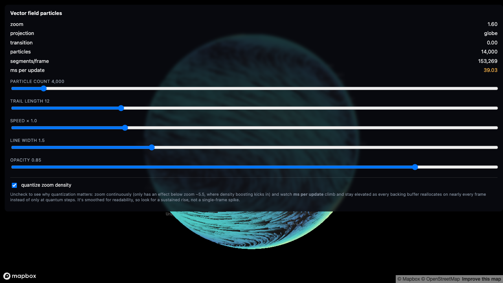

# 06-particle-field

> Status: 🔬 **Reproduced** — builds clean, 48/48 unit tests, and verified in a browser with a real token: the field renders as flowing streaks that hug the sphere, and the density/quantization controls behave as described.



### Measured cost, and why the defaults are conservative

Read off the running example. These came from a **software renderer** (SwiftShader, no GPU), so treat them as an upper bound on real hardware — but the shape of the curve is the point:

| particle count (slider) | particles after zoom boost | segments / frame | ms / update |
|---|---|---|---|
| 1,000 | 4,000 | 19,902 | 5.0 |
| **4,000** (default) | **14,000** | **153,269** | **39.0** |
| 10,000 | 38,000 | 569,538 | 99.1 |

The slider goes to 50,000. It is deliberately not the default: at low zoom the adaptive density multiplies the slider value (that is the whole point of the feature), so the number you set is not the number you get, and the top of the range will stall a software renderer entirely. Start low, raise it until your own frame budget complains.

Tens of thousands of short, flowing, fading line segments — a nullschool-style wind/current field — advected through a **synthetic, analytic** vector field and hugging Mapbox's globe projection. This is the runnable companion to [3.3 Vector field particles](../../docs/03-scaling-up/vector-field-particles.md), ported from its source, `mini-taiwan-pulse/src/map/climateParticleLineLayer.ts`, with the PNG/raster wind texture it normally reads replaced by a closed-form formula (see "Where the math comes from" below) so this example needs no external data file and no tiling service.

## Check the native layer first

Before reaching for any of this: **Mapbox GL JS has a built-in flow-field layer.** [`raster-particle`](https://docs.mapbox.com/style-spec/reference/layers/#raster-particle) (v3.3.0+, globe-flicker-fixed in v3.4.0) animates particles over a `raster-array` source and projects onto the globe by itself, for free, with no custom layer at all — there's an [official wind example](https://docs.mapbox.com/mapbox-gl-js/example/raster-particle-layer/). If your data can live in that format, use it and stop reading here.

It can't, for this example specifically, for two of the recipe's stated reasons:

- **The data isn't in Mapbox's `raster-array` format, and never will be.** Feeding your own data into `raster-particle` means uploading and processing it through [Mapbox Tiling Service](https://docs.mapbox.com/mapbox-tiling-service/examples/raster-mts-wind/) first — it will not read a self-hosted tile endpoint or an arbitrary texture. This example's field is generated at runtime from a closed-form formula (see below); there's nothing to tile, and no tiling service to depend on.
- **It needs to run on MapLibre too**, at least in principle — `raster-particle` has no MapLibre equivalent, so anything built on it is Mapbox-only by construction. This example's approach (raw WebGL2, a hand-rolled `CustomLayerInterface`) ports to MapLibre with only the globe-transition uniform's sign flipped (see [1.3 Porting](../../docs/01-hugging-the-globe/porting.md)).

Those are the recipe's own exclusions, reproduced here for the same reason the recipe states them: not because the native layer is inadequate in general, but because this specific example is a demonstration of the hand-rolled technique, and needs data that has no path into `raster-array` at all.

## What it demonstrates

- **CPU-side Euler (first-order) advection** (`src/advection.ts`): each particle's lon/lat is stepped forward every frame by sampling the field and integrating one step, with the frame's wall-clock `dt` clamped to a low ceiling (`MAX_FRAME_DT = 1/20`) so a backgrounded tab regaining focus doesn't fling every particle across the map in one jump.
- **A synthetic, analytic wind field** (`src/flowField.ts`): a latitude-banded prevailing wind plus nine deterministic Gaussian vortices, built entirely from bounded trig and polynomial terms — no PNG, no fetch, no external dataset. Deterministic (fixed seed), globally continuous (including across the antimeridian), and finite at both poles. See "Where the math comes from" below.
- **An actual O(1) circular ring buffer per particle** (`src/particleTrailBuffer.ts`), each slot caching its mercator-space position once, at push time. See "Where this differs from the source" for why this isn't quite what the source implementation does, despite the recipe calling that a "ring buffer" too.
- **Instanced fat lines**: each trail segment is one 8-float instance (`fromMerc.xy`, `toMerc.xy`, `rgba`) drawn from a static six-vertex quad via `drawArraysInstanced` — the recipe's "8 floats carry a whole segment" technique, unchanged from the source.
- **Quantized zoom-adaptive density, with the naive version kept around as a toggle** (`src/adaptiveDensity.ts` + the "quantize zoom density" checkbox): uncheck it and zoom continuously to watch `ms per update` jitter as every particle buffer reallocates on nearly every single frame instead of only at quantum steps.
- **The same globe-hugging vertex shader technique** as every other example in this repo (`mercToWorld`, ECEF backface cull, `uTransition` blend, `depthTest: false`) — but here it's the *moving*-geometry branch from [1.1's "Unless your geometry moves"](../../docs/01-hugging-the-globe/mapbox.md#unless-your-geometry-moves--then-do-it-in-the-shader): every vertex re-derives its position from mercator every frame, because nothing in a flow field has a fixed position to precompute against.
- **Raw WebGL2, no Three.js** — see "Why raw WebGL2, not Three" below.

## Running it

```bash
cd examples/06-particle-field
npm install
cp .env.example .env      # then edit .env and set VITE_MAPBOX_TOKEN
npm run dev
```

Get a free token at <https://account.mapbox.com/access-tokens/>. Without one, the page shows an on-screen message instead of a blank map or a crash — it never reads any `.env` file that isn't your own, and no token is committed anywhere in this repo.

## Verifying it without a token

This example was built and tested without ever opening it in a browser (no Mapbox token was available while writing it) — see the Status line above. What *was* verified:

```bash
npm install
npx tsc --noEmit    # 0 errors
npx vitest run      # 48/48 tests pass
npm run build        # succeeds (vite build)
```

The tests are spread across four pure modules — `src/flowField.ts`, `src/advection.ts`, `src/particleTrailBuffer.ts`, `src/adaptiveDensity.ts` — none of which import `mapbox-gl` or touch WebGL/DOM; they run under Node. What they check:

- **Antimeridian continuity** (`flowField.test.ts`): a query at lon=179.99 and lon=-179.99 (0.02 degrees apart) must sample close vectors relative to the field's speed scale, and — more rigorously — the gap between two dateline-straddling samples must **shrink** as the two points move closer together (0.02° → 0.002° → 0.0002°). A genuine discontinuity (a forgotten wrap) would not shrink at all as the gap narrows; this is the test that actually distinguishes "continuous" from "happens to look continuous at one sample spacing".
- **Pole safety** (`flowField.test.ts`): never NaN/Infinity at exactly ±90°, approaching ±90°, or for a vortex centered exactly on a pole.
- **Vortex shape** (`flowField.test.ts`): velocity is exactly zero at a vortex's own center (a calm eye, not a discontinuity) and decays to near-zero well outside its radius.
- **Euler integration** (`advection.test.ts`): a huge raw `dt` (e.g. a backgrounded tab resuming after minutes) produces exactly the same result as the clamped `MAX_FRAME_DT` would; two half-steps (re-sampling the field at the midpoint) approximate one double-length step, with an error that's nonzero (re-sampling has to matter) but shrinks as the step size shrinks — first-order consistency.
- **Ring buffer** (`particleTrailBuffer.test.ts`): pushing past capacity overwrites only the single oldest slot, never the newest; samples read back in newest-to-oldest order; writes to one particle never touch another's slots; the mercator cache survives unchanged.
- **Zoom density quantization** (`adaptiveDensity.test.ts`): sweeping zoom continuously (551 samples) produces fewer than 30 distinct particle counts through the quantized function, vs. 3×+ more distinct counts through the unquantized one — and within one quantum-sized zoom range the count is bit-identical, not merely close.

None of this proves the shader compiles or looks right in an actual WebGL context — that's exactly what "visual verification pending" in the Status line means.

## Where the math comes from

The field (`src/flowField.ts`) is the sum of two closed-form parts, both deterministic and evaluated fresh at every particle position, every frame — there's no texture, no fetch, no external dataset:

1. **A latitude-banded prevailing wind**: `amplitude * sin(bands * latitude)` — purely a function of latitude, so it never touches longitude at all and is trivially continuous across the antimeridian. Bounded in `[-amplitude, amplitude]` at every latitude, poles included, since `sin` never diverges.
2. **Nine deterministic Gaussian vortices** (seeded PRNG, `mulberry32`, same technique as `04-moving-trajectory/src/objectPath.ts`'s route generator), each contributing velocity as the **curl of a radially-symmetric Gaussian bump**, computed in 3D:

   ```ts
   const p = toUnitEcef(lon, lat);        // query point as a unit ECEF-style vector
   const c = toUnitEcef(vx.lon, vx.lat);  // vortex center, same
   const d = angularDistanceDeg(vx.lon, vx.lat, lon, lat); // TRUE great-circle distance
   const gaussian = exp(-(d*d) / (2 * sigma * sigma));
   const tangent3 = cross3(c, p);          // tangent at p; zero at center AND antipode
   const scale = (vx.strengthMs / sigmaRad) * gaussian;
   // project (tangent3 * scale) onto the local east/north basis at p -> (u, v)
   ```

   This went through two earlier, rejected designs, both worth naming because they're the mistakes this recipe is most likely to reproduce if ported casually:

   - **A bearing/`atan2`-based "rotate the radial direction by 90°" version.** A bearing is continuous everywhere except at the vortex's own center and antipode, but "continuous" isn't the same as "well-conditioned": close to a core, a bearing's *direction* is acutely sensitive to tiny position changes (the same way compass bearing near the true pole swings wildly for a small step). Two points 0.02° apart near a nearby core disagreed by several percent of the local wind speed — a real numerical finding, not the antimeridian bug it initially looked like.
   - **A flat-plane `(Δlon · cos(vortex latitude), Δlat)` displacement, windowed by the *flat* distance `sqrt(dx² + dy²)`.** This fixed the bearing problem (no more direction computation at all) but introduced a different, worse one: `wrapDeltaLonDeg` (wrapping a longitude difference into `(-180, 180]`) has its own seam, at whatever longitude is exactly opposite the vortex's own — which is **not** generally the map's antimeridian, and for a high-latitude vortex the *flat* distance to that seam shrinks well below its true 180° great-circle distance (the longitude term gets multiplied by `cos(latitude)`). For a wide (36°), high-latitude (70°) vortex, that seam carried a real, visible jump of several m/s — caught by this example's own tests before it shipped (see `flowField.test.ts`'s "regression" case), not by inspection.

   The version above avoids both: `toUnitEcef` converts lon/lat to a 3D point using only `sin`/`cos` of the raw angle (exactly periodic, so lon=180 and lon=-180 produce the *same* 3D point, not merely a close one — there is no longitude-difference wrap anywhere left in the file), and `cross3(c, p)` is a smooth, real-analytic function of two such points that is exactly zero at the vortex's center **and** its antipode, with no seam at any other longitude, at any latitude.

**Antimeridian safety**: structural, not case-by-case — the only two places a longitude value is used are inside `sin(lonRad)`/`cos(lonRad)` (building the 3D point and the local east/north basis) and inside `cos(lon1 - lon2)` (`angularDistanceDeg`'s spherical law of cosines), both exactly 2π-periodic. There is no remaining seam at a vortex's antipodal *meridian* — only a single antipodal *point*, where the cross product is exactly (not approximately) zero. Tested directly: `flowField.test.ts`'s "every default vortex stays continuous across ITS OWN antipodal meridian" sweeps all nine.

**Pole safety**: `toUnitEcef` maps every point at `lat = ±90` to the same single 3D point regardless of longitude — reflecting that a pole genuinely has no longitude, rather than producing an arbitrary or unstable one. No `atan2`/`asin` anywhere in the per-frame sampling path; the one `acos` (inside `angularDistanceDeg`, used only for the Gaussian's radial falloff) is clamped against float rounding.

## Why raw WebGL2, not Three

Same reasoning as the recipe's own "Why raw WebGL2, not Three" section, and the same choice as its source file: a Three.js renderer sharing Mapbox's GL context carries real bookkeeping cost. Every Three-based example in this repo (`01-points-on-globe`, `04-moving-trajectory`) has its Scene class call `renderer.resetState()` before and after every render, and manually save/restore several pieces of GL blend state so Three doesn't leave Mapbox's own next draw call corrupted. A layer that needs exactly one shader program, one VAO, and two buffers never owns a competing renderer, scene graph, or camera object on a context it doesn't exclusively control — for a field of uniform, instanced quads, that's strictly less machinery to get wrong. This is also why `package.json` here has no `three`/`@types/three` dependency at all, unlike every other example in this repo — there's nothing in this file that would use them.

## Adjustable parameters

| Control | Where | Default | Effect |
|---|---|---|---|
| Particle count | HUD slider | 10,000 (range 1,000–50,000) | Base particle count before zoom-adaptive boosting. Changing it reallocates every backing buffer (ring buffer, position/age arrays) — a deliberate, infrequent user action, unlike the automatic per-frame zoom boost below. |
| Trail length | HUD slider | 16 (range 4–40) | Physical ring-buffer capacity per particle (not just a fade window, unlike `04-moving-trajectory`'s `uTrailWindow` — see "Deliberate simplifications"). Also reallocates on change. |
| Speed × | HUD slider | 1.0 (range 0.1–4) | Multiplies `timeScaleSeconds` (45,000 simulated seconds per real second at 1×) into how much simulated time each frame advects through. |
| Line width | HUD slider | 1.5 (range 0.5–4) | `u_line_width`, in device pixels. |
| Opacity | HUD slider | 0.85 (range 0.1–1) | Overall layer alpha, multiplied into every segment's per-age fade. |
| **Quantize zoom density** | HUD toggle | on | Off routes zoom through `adaptiveDensity.ts`'s `rawDensity` instead of `quantizedDensity` — see "The quantization toggle" below. |
| `ADAPTIVE_QUANTUM` | `src/adaptiveDensity.ts` constant | 2,000 | Particle-count rounding step for the quantized path (the recipe's source uses 4,000, tuned for its 60,000-particle ceiling; this example halves both to match its own 50,000 ceiling). |
| `MIN_TRAIL_LENGTH` / `MAX_TRAIL_LENGTH` | `src/particleFieldLayer.ts` constants | 4 / 40 | Trail-length slider's range. |
| `SPEED_MAX_MS` | `src/flowField.ts` constant | 26 | Speed → color-ramp normalization ceiling. |

### The quantization toggle

This is the recipe's own point, made interactive: **`resize()` reallocates every backing typed array whenever the target particle count changes at all.** With quantization on, a continuous zoom gesture only crosses a new target every couple of zoom levels, so `resize()` is a no-op for the overwhelming majority of zoom deltas. Uncheck "quantize zoom density" and zoom continuously (not by discrete steps) — the density function now recomputes a slightly different target from the raw, unrounded zoom value on nearly every frame, `resize()` reallocates every single time, and the HUD's **ms per update** readout climbs and stays elevated, exactly the "GC storm during exactly the interaction that most needs to stay smooth" the recipe warns about. Two caveats worth knowing before judging what you see: the toggle only has anything to demonstrate below `ADAPTIVE_BASE_ZOOM` (~5.5) — above that, both functions return the base count unboosted, no reallocation either way — and the HUD value is an exponential moving average (`main.ts`, α=0.15) for legibility, so look for a *sustained* rise rather than expecting a spike on every single frame.

## Where this differs from the source

Ported from `mini-taiwan-pulse/src/map/climateParticleLineLayer.ts` via [the recipe](../../docs/03-scaling-up/vector-field-particles.md); differences worth flagging back to the doc:

- **"Ring buffer" is a looser term than the source's actual data structure.** The recipe's "CPU-side Euler advection" section says each particle "keeps a short ring buffer of past normalized positions", and its "What is cached" section shows the real mechanism: on every step, every history slot is shifted down by one (`for (let s = trailPoints - 1; s >= 1; s--) { historyX[base+s] = historyX[base+s-1]; ... }`) — an **O(trailPoints) array shift per particle per frame**, not an O(1) circular write through a wrapping index. That's a legitimate, working implementation of "keep the last N samples", but it isn't what "ring buffer" technically denotes (compare `04-moving-trajectory/src/trailRingBuffer.ts`'s `TrailRingBuffer`, which *is* an index-based circular buffer, `slotForTick = tick % capacity`, O(1) per write). This example's `src/particleTrailBuffer.ts` implements the latter instead — a genuine circular buffer with a per-particle write-head index — specifically because the recipe's own vocabulary promised one. Worth either loosening the doc's wording ("a fixed-size trailing history, kept via array-shift" rather than "ring buffer") or noting that a true circular buffer is a strictly cheaper drop-in alternative for the same idea.
- **The field's data source (PNG raster vs. analytic formula) is orthogonal to everything else the recipe teaches**, but the doc is written entirely in terms of the PNG/bilinear-sampling case ("The field lives in a PNG, sampled bilinearly" is presented as *the* technique, not *a* technique). This example is the existence proof that the CPU-side Euler advection, the instanced fat-line rendering, the globe-hugging shader, and the zoom-density quantization are all independent of where the u/v values come from — worth a line in the doc noting the field source is swappable.
- **The doc's "for every corner of every segment" (in "Why per-vertex trigonometry is correct here") undercounts by half.** The fat-line vertex shader (unchanged from the source, reproduced verbatim in `src/particleFieldLayer.ts`) computes **both** endpoints' projected positions in every vertex invocation — `mercToWorld(a_from, ...)` *and* `mercToWorld(a_to, ...)`, regardless of which of the six corners is executing — because the screen-space line direction/normal needs both ends. That's 2 inverse-Mercator evaluations per vertex, 12 per segment, not 6. Same category of undercount as `04-moving-trajectory`'s README correction of this same doc's "four transcendentals" framing (it's six calls, not four kinds) — this one is a 2x undercount in the vertex-shader-specific recipe instead.
- **The doc's "fractional-degree step" (in "CPU-side Euler advection") is imprecise about units.** The snippet immediately below that phrase computes `(vec.u * flowSeconds / metersPerDegLon) / lonSpan` — the final `/ lonSpan` (and `/ latSpan` for the other axis) normalizes the step into the field's own `[0, 1]` UV space, not degrees. It's only a "fractional-degree" step in the special case `lonSpan == 360` (a truly global field with no sub-region cropping); the source's actual bbox is a regional subset, so in production this is a fractional-*normalized-UV* step. This example's `src/advection.ts` works directly in degrees throughout (no normalization step), which sidesteps the ambiguity rather than resolving it.
- **`renderingMode` guidance is inconsistent between two examples in this same repo, and the doc doesn't address it.** `01-points-on-globe/src/glowLayer.ts`'s comment states a globe-hugging custom layer needs `renderingMode: "3d"` ("Custom layers that hug the globe need this"). This example uses `"2d"` — unchanged from the source layer, which does hug the globe and is reported as running in production, on a different style/layer stack than this example's `dark-v11`. At least one of those two claims is overstated, or the real answer is "it depends on what else is in the layer stack" — neither this example's tests nor `tsc` touch WebGL, so which one is right here is exactly the kind of thing "visual verification pending" (see Status) is waiting to confirm: if particles don't appear on the globe at all, `"2d"` vs `"3d"` is the first thing to try flipping. Worth a line in `mapbox.md` clarifying what actually determines the right choice.
- **`ADAPTIVE_QUANTUM` and the particle-count ceiling are both halved** (2,000 / 50,000 here vs. the source's 4,000 / 60,000) — a parameter choice for this example's slider range, not a claim that the recipe's numbers are wrong.

## Deliberate simplifications

Compared to what the source production layer does:

- **Peak vortex speed is an approximate calibration, not an exact one.** `scale = strengthMs / sigmaRad` is chosen so peak tangential speed lands roughly near `strengthMs`, but the exact peak also depends on how `sin(true angular distance)` behaves for a given `radiusDeg` (see "Where the math comes from") — for this generator's range (14–36°) the observed peak across the whole default vortex set is ~20 m/s against a nominal 8–18 m/s `strengthMs` range, close enough for a color ramp normalized by `SPEED_MAX_MS = 26`, but not a closed-form guarantee.
- **No PNG/raster field, no bilinear sampling, no alpha validity mask, no `maskErodePx` coastline erosion.** The source reads a real (if externally-supplied) u/v texture with a land/sea mask; this example's field is globally defined everywhere by construction, so there's nothing to mask.
- **No `setField`/live dataset swapping.** The source can hot-swap to a new day's wind texture mid-flight while preserving particle history (`swapField`); this field never changes, so there's nothing to swap.
- **Global, viewport-independent respawning.** The source biases 90% of particle respawns to land inside the current viewport (`spawnBounds`), which matters when zoomed into a small region of a much larger dataset. This example spawns uniformly over the whole sphere every time, simpler but less efficient at high zoom (many respawned particles land off-screen). The zoom-adaptive density boost is a separate mechanism (more particles overall) and doesn't compensate for this.
- **No repaint throttling and no popups/hit-testing** — the same two simplifications every example in this repo makes, for the same reasons (see e.g. `01-points-on-globe`'s README).
- **The trail-length slider is not quantized.** Unlike particle count (which is both quantized *and* zoom-driven automatically), trail length only changes on a deliberate, infrequent user drag — the recipe's quantization concern is specifically about a *continuous, automatic* driver (zoom) causing per-frame reallocation, which a manual slider drag isn't.

## Source

Extracted from `mini-taiwan-pulse`: `src/map/climateParticleLineLayer.ts`, via [docs/03-scaling-up/vector-field-particles.md](../../docs/03-scaling-up/vector-field-particles.md). The globe-hugging shader and ECEF backface cull are unchanged from that source and from [1.1 Hugging the globe: Mapbox GL JS](../../docs/01-hugging-the-globe/mapbox.md). The synthetic flow field, the circular ring buffer, and the zoom-density quantization toggle are new to this example — see "Where this differs from the source" above for exactly what and why.
