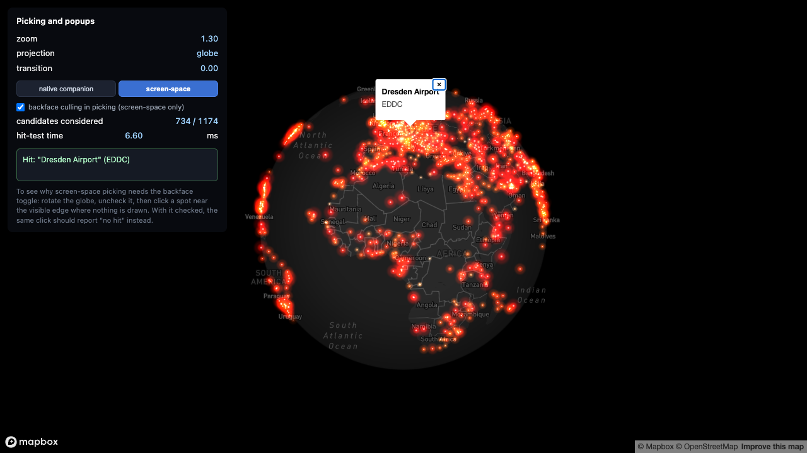

# 07-picking-and-popups

> Status: 🔬 **Reproduced** — builds clean, 45/45 unit tests, and verified in a browser with a real token. Both strategies were exercised on the running example: the native companion layer returned `Khrabrovo Airport (UMKK)` in 9.80 ms, and screen-space picking returned `Dresden Airport (EDDC)` in 6.60 ms. The backface toggle was confirmed to do what it claims — see below.



### The backface number, measured

The clearest evidence that backface culling matters in picking is the candidate count, and you can watch it change:

| `backface culling in picking` | Candidates considered | What that means |
|---|---|---|
| **on** | **734 / 1,174** | Only airports on the hemisphere facing you are eligible |
| **off** | **1,174 / 1,174** | Every airport is eligible, including the 440 behind the planet |

`map.project()` is pure matrix arithmetic. It happily returns a valid on-screen position for a point on the **far side** of the globe, because a sphere's front and back both fall inside the same visible disc. Nothing about the returned coordinate says "this is behind the Earth". Without the ECEF-space cull from [1.1](../../docs/01-hugging-the-globe/mapbox.md), those 440 points stay clickable and your users will occasionally select something on the other side of the world.

The same glowing airport points as [`01-points-on-globe`](../01-points-on-globe/), except this time you can click one. [`00-native-vs-custom`](../00-native-vs-custom/) already showed you the problem -- click the custom layer and nothing happens, ever, because `CustomLayerInterface` never participates in `queryRenderedFeatures`. This example is the answer: two working strategies for making a custom layer clickable anyway, built side by side so you can compare what each one costs.

## The three strategies (per [decision-tree.md Q5](../../docs/00-start-here/decision-tree.md#q5--does-the-user-need-to-click-it))

| # | Strategy | Implemented here? |
|---|---|---|
| 1 | Companion native layer | Yes -- [`src/nativeCompanionLayer.ts`](src/nativeCompanionLayer.ts) |
| 2 | Screen-space picking (`map.project()` + backface test) | Yes -- [`src/screenSpacePicking.ts`](src/screenSpacePicking.ts), [`src/backfaceCull.ts`](src/backfaceCull.ts), [`src/spatialGrid.ts`](src/spatialGrid.ts) |
| 3 | GPU ID buffer | **No -- described below only** |

Switch between the two implemented strategies live with the HUD's strategy buttons. Both end up at the exact same [`showAirportPopup`](src/popup.ts) call -- the only thing that differs between them is *how they find the point you clicked*, not what happens once they have.

### Strategy 1: companion native layer

[`src/nativeCompanionLayer.ts`](src/nativeCompanionLayer.ts) adds a second, invisible `circle` layer (`circle-opacity: 0`) over the *same* airport data the custom layer draws. Clicking calls `map.queryRenderedFeatures(point, { layers: [COMPANION_LAYER_ID] })` -- ordinary native hit-testing, same mechanism as [`00-native-vs-custom`](../00-native-vs-custom/)'s popup.

Two things have to be true for this to work, and both are load-bearing:

- **Same source of truth for position.** The companion layer's GeoJSON and the custom layer's Three.js buffers both come from one `loadAirports()` call in `main.ts`. If they ever read from two different sources of "where is this airport", you get a real bug: the dot you *see* and the circle you can *click* drift apart, and a user reports "I clicked directly on it and nothing happened" or the reverse.
- **The invisible circle's radius has to track the visible dot's radius**, or clicking near the edge of a big dot misses. `companionCircleRadiusExpression()` builds a `circle-radius` expression that approximates `glowPointsScene.ts`'s per-point size *and* its zoom scaling -- see "Deliberate simplifications" below for exactly how approximate.

**The wall this example actually hit while combining "per-point size" with "zoom scaling":** the natural first draft multiplies two `interpolate` expressions together -- `["*", <sizeNorm interpolate>, <zoom interpolate>]`. Mapbox's style spec rejects that at `addLayer()` time: `["zoom"]` may **only** be used as the input to a *top-level* `interpolate`/`step`, never nested inside another expression such as `*`. The fix inverts the nesting -- the outer expression interpolates on zoom, and each zoom stop's *output* is itself `["*", <constant>, <sizeNorm interpolate>]` (data expressions like `get`, unlike `zoom`, are allowed anywhere). Both `tsc` and a plain "does it run" test miss this class of bug -- the expression's TypeScript type accepts either shape, and only a test that inspects the expression tree specifically will catch it (see `nativeCompanionLayer.test.ts`). This is exactly the kind of "looks free until you try to align it with the shader" pitfall this example otherwise just describes in the abstract.

**What you get for free with this strategy, and why:** Mapbox renders and hit-tests native layers through its own globe-aware pipeline, which already excludes far-side geometry. A companion circle on the far side of the globe is not drawn and cannot be clicked -- correct backface behavior, with zero ECEF code written for it. Compare with strategy 2, which has to earn this the hard way.

### Strategy 2: screen-space picking

[`src/screenSpacePicking.ts`](src/screenSpacePicking.ts) projects each candidate airport to a screen pixel with `map.project([lon, lat])` and finds the nearest one to the click, within a fixed pixel radius (`PICK_RADIUS_PX = 14` in `main.ts`).

**The trap, and the reason this example exists:** `map.project()` is pure projection math -- the same matrix multiply the vertex shader runs -- with no idea whether the point it just projected is actually visible or hidden behind the globe's own surface. Every point on a sphere, front-facing or not, lands *somewhere inside the globe's on-screen silhouette* once projected this way: a camera ray to any far-side point necessarily crosses the near hemisphere first, so the sphere's silhouette on screen is the full extent anything on it can ever project to. Screen position alone cannot distinguish "the dot in front of you" from "an airport on the exact opposite side of the Earth that happens to project near here." Without a backface test, screen-space picking will confidently return a hit for a point that is not visible at all.

The fix is [`src/backfaceCull.ts`](src/backfaceCull.ts)'s `isFrontFacing()`: the same ECEF dot-product test [`docs/01-hugging-the-globe/mapbox.md`'s "Step 4"](../../docs/01-hugging-the-globe/mapbox.md#step-4-cull-the-far-side-yourself) describes for the *visual* cull, run here against pickable candidates instead of vertices. It needs the camera's position in ECEF space for the current frame -- rather than re-deriving that independently (two derivations of the same quantity that could quietly drift apart after the next edit), this example threads the *exact* `cameraEcef` the custom layer's own shader already computed for its visual cull out through a modified `onFrameInfo` callback (see "What's copied vs. new" below). One computation, two consumers.

**The HUD's "backface culling in picking" checkbox turns this test off and on.** With it **off**, `screenSpacePicking.ts` receives `cameraEcef: null` and skips the filter entirely -- every candidate is projected and searched, including ones genuinely hidden behind the globe. With it **on** (the default), candidates that fail `isFrontFacing()` are excluded before the nearest-point search ever sees them.

**How to see the bug this causes:** rotate the globe so you're looking mostly at open ocean or another empty-looking area, uncheck "backface culling in picking", and click there. With ~1,174 airports spread across the whole planet, roughly half of them are on the far side at any moment, and (per the silhouette argument above) their projected screen positions land somewhere inside the visible globe disc -- so a click on visually empty space stands a real chance of reporting a hit for an airport you cannot see. Check the box again and click the same spot: it should report "no hit" instead. The HUD's "candidates considered" row makes the mechanism visible even without spotting the exact pixel: it roughly halves when the toggle is checked, since backface-failing candidates are dropped before the search runs.

*(This paragraph describes the expected mechanism, reasoned from `map.project()`'s documented behavior and the projective-geometry argument above -- see the Status line. It has not been visually confirmed in a browser.)*

**Performance, and why there's a spatial grid:** at this example's scale -- one search per click, ~1,174 candidates -- a plain loop over every candidate ([`src/nearestPoint.ts`](src/nearestPoint.ts)'s `findNearestBruteForce`) is fast enough that you would not notice the difference. [`src/spatialGrid.ts`](src/spatialGrid.ts)'s `SpatialGrid` (a uniform grid bucketed by screen pixel, cell size = the pick radius) exists to demonstrate the *shape* of the fix once "search every candidate" stops being free -- thousands of moving vehicles, a country's worth of sensors, a search running every mousemove instead of every click. `screenSpacePicking.ts` builds a fresh grid per click; that's the right call at N=1,174 (rebuilding is cheap and there's no stale-index risk), and the wrong call once N or query frequency get large enough that grid *construction* itself shows up in a profile -- at that point you'd want a persistent grid, updated incrementally, not rebuilt from scratch every time.

### Strategy 3: GPU ID buffer (not implemented)

Render every pickable object a second time into an off-screen target, with each object's color encoding its ID instead of its real appearance. On click, `gl.readPixels()` the single pixel under the cursor and decode the ID back out.

This is described here, not implemented, because it costs real things this example's other two strategies don't:

- **A second render target and a second draw call per frame** (or per click, if you only render the ID pass on demand) -- real GPU and CPU budget, paid continuously if done every frame.
- **`gl.readPixels()` is a synchronous GPU/CPU sync point.** It stalls the pipeline waiting for the GPU to finish rendering before the CPU can read the result back -- exactly the kind of cost a real-time render loop is usually built to avoid. (An async variant using `gl.getBufferSubData` with a PBO exists, but trades the stall for a frame or more of latency between click and answer, and is meaningfully more code.)
- **ID encoding/decoding discipline** -- packing an integer ID into an RGBA color and decoding it back exactly, including whatever anti-aliasing or blending you'd otherwise want turned off for this pass specifically (blending an ID buffer produces garbage IDs at edges).

It is the right answer when picking must be pixel-exact against dense, overlapping, or irregularly-shaped custom geometry (not simple points) where neither of the other two strategies can express "which specific pixel-covering object is this." Neither companion layers nor screen-space nearest-point search help you pick, say, "which of these 500 overlapping instanced triangles is under the cursor" -- an ID buffer answers that directly, in one texture read, regardless of shape or overlap.

## The HUD

- **`zoom` / `projection` / `transition`** -- the same globe-state readout as [`00`](../00-native-vs-custom/)/[`01`](../01-points-on-globe/).
- **Strategy switch** -- `native companion` / `screen-space`. Chooses which strategy answers the *next* click; both layers/candidates exist simultaneously regardless of which one is selected.
- **`backface culling in picking` checkbox** -- only affects strategy 2 (see above). Strategy 1 gets correct backface behavior from Mapbox's own native rendering regardless of this checkbox's state.
- **`candidates considered`** -- for strategy 2, how many airports survived the backface filter (or all 1,174, when the filter is off or you're in mercator mode) and were actually projected + searched. Reads `n/a (native hit-test)` for strategy 1, since `queryRenderedFeatures` doesn't expose a "how many features did you check" count to report.
- **`hit-test time`** -- wall-clock `performance.now()` delta around the hit test itself (`queryRenderedFeatures` call, or `pickScreenSpace()` call), in milliseconds. Not a benchmark claim -- see "Deliberate simplifications".
- **Click result** -- the airport name + ICAO ident on a hit, or "No hit."

## Data: what's real and what's synthetic

Identical to [`00-native-vs-custom`](../00-native-vs-custom/#data-whats-real-and-whats-synthetic) and [`01-points-on-globe`](../01-points-on-globe/#data-whats-real-and-whats-synthetic): positions and names are real (`public/airports.json`, 1,174 `large_airport` rows from [OurAirports](https://ourairports.com/data/airports.csv), public domain, unchanged). Point size (`sizeNorm`) is **synthetic** -- a stable hash of each airport's `ident`, with no relationship to real passenger or flight volume. Don't read anything into which airport you happen to click and which one is nearby but slightly missed.

## Running it

```bash
cd examples/07-picking-and-popups
npm install
cp .env.example .env      # then edit .env and set VITE_MAPBOX_TOKEN
npm run dev
```

Get a free token at <https://account.mapbox.com/access-tokens/>. Without one, the page shows an on-screen message instead of a blank map or a crash -- it never reads any `.env` file that isn't your own, and no token is committed anywhere in this repo.

## Verifying it without a token

This example was built and verified without ever opening it in a browser (see the Status line above). What *was* verified:

```bash
npx tsc --noEmit    # 0 errors
npx vitest run      # 45/45 tests pass
npm run build       # succeeds (vite build)
```

The 45 tests, across six files, all run without a WebGL context or a live map:

- [`src/backfaceCull.test.ts`](src/backfaceCull.test.ts) (8 tests) -- `frontFacingDot`/`isFrontFacing` against algebraically-constructed cases: dead-on facing (dot = +1), dead-on away (dot = -1), an exact horizon (dot = 0, constructed so the camera-to-point vector is perpendicular to the surface normal by construction, not by trial and error), a documented boundary decision (dot === 0 counts as front-facing), and a monotonic sweep confirming the sign flips exactly once as a camera orbits from facing to away.
- [`src/nearestPoint.test.ts`](src/nearestPoint.test.ts) (7 tests) -- nearest-within-radius, null when nothing qualifies, inclusive/exclusive at the exact radius boundary, an empty-input edge case, and the tie-break rule (first point in input order wins) demonstrated in both directions so it's provably about input order and not some property of the points.
- [`src/spatialGrid.test.ts`](src/spatialGrid.test.ts) (6 tests) -- `SpatialGrid.queryNearest` compared against `findNearestBruteForce`: 500 random points against 200 random queries in one test, then 300 random points reused across three cell-size/radius combinations (100 queries each, one combination with the query radius exceeding the cell size to exercise the multi-ring neighbor scan) in another -- 800 points and 500 queries total, all from a seeded PRNG (`mulberry32`, reproducible across runs -- see the file's header comment for why a "random" test needs to be deterministic). Plus: empty-grid, `clear()`, a non-positive cell size throwing, and a point sitting near a cell boundary being found by a query one cell over (an off-by-one regression guard).
- [`src/nativeCompanionLayer.test.ts`](src/nativeCompanionLayer.test.ts) (4 tests) -- a structural check on `companionCircleRadiusExpression()`'s output: confirms it's a top-level `interpolate` on `["zoom"]`, and that no `["zoom", ...]` expression is nested anywhere below that top level -- the specific style-spec violation described above, pinned down so it can't quietly come back. Neither `tsc` nor a plain "does it run" test would catch this; it only shows up if something inspects the expression tree.
- [`src/globeProject.test.ts`](src/globeProject.test.ts) (13 tests) -- copied unmodified from `00`/`01`; the same globe-hugging math tests (`lonLatToEcef`, `mercatorToGlobe`).
- [`src/airportsGeoJSON.test.ts`](src/airportsGeoJSON.test.ts) (7 tests) -- copied unmodified from `00`; the GeoJSON conversion feeding the companion layer (feature count, `[lon, lat]` coordinate order, property passthrough).

None of these can verify that either strategy actually finds the airport you click in a running browser, that the backface toggle visibly changes behavior, or that the companion layer's radius is actually well-aligned with the visible dot -- trust your eyes over this README if you run it with a real token and something looks wrong.

## What's copied vs. new

Copied **unmodified** from [`examples/00-native-vs-custom`](../00-native-vs-custom/) / [`01-points-on-globe`](../01-points-on-globe/):

- `src/globeProject.ts`, `src/globeProject.test.ts`
- `src/airports.ts`
- `src/airportsGeoJSON.ts`, `src/airportsGeoJSON.test.ts`
- `public/airports.json`
- `src/vite-env.d.ts`

**Modified, not copied verbatim** (see each file's own docstring for the exact diff and why):

- `src/glowPointsScene.ts` -- added `getCameraEcef()` + a `cameraEcefValid` flag, so this frame's camera-ECEF (already computed for the shader's own backface cull) can be read from outside the scene. Drawing logic untouched.
- `src/glowLayer.ts` -- `onFrameInfo` now also reports `cameraEcef` alongside the existing `isGlobe`/`transition`.

New for this example:

- `src/nativeCompanionLayer.ts`, `src/nativeCompanionLayer.test.ts` -- strategy 1
- `src/backfaceCull.ts`, `src/screenSpacePicking.ts`, `src/spatialGrid.ts`, `src/nearestPoint.ts`, `src/pickingCandidates.ts` -- strategy 2 and its supporting pure-math modules
- `src/popup.ts` -- the shared popup display path both strategies call into
- `src/main.ts` -- HUD wiring, strategy switch, the unified click handler
- `index.html` -- same visual language as `00`/`01`, restructured for the strategy switch, backface toggle, and considered-count/timing readouts

## Deliberate simplifications

- **The companion layer's click radius is an approximation, not an exact match.** `companionCircleRadiusExpression()` (in `nativeCompanionLayer.ts`) is a piecewise-linear `interpolate` expression hand-fit to `glowPointsScene.ts`'s `pow(1.4, zoom - 3)` zoom curve at a handful of points, and it does not reproduce the shader's continuous 0.8x-1.0x pulse animation (`0.9 + 0.1 * sin(...)`) at all -- there is no native-layer equivalent for that. Good enough for a click target; not pixel-perfect.
- **Screen-space picking's radius is a flat pixel constant** (`PICK_RADIUS_PX = 14` in `main.ts`), not zoom-adaptive like the actual rendered dot size (10-56px, scaled by zoom). A real app would scale this with zoom too.
- **`pickScreenSpace()` rebuilds a `SpatialGrid` from scratch on every click.** Reasonable at 1,174 candidates and one query per click; the wrong call at a scale where grid *construction* itself becomes the bottleneck -- see strategy 2's "Performance" note above.
- **The "candidates considered" and "hit-test time" HUD numbers are real measurements of this example's own code, not a claim about either strategy's performance in general.** They will vary by machine, by how many airports pass the backface filter this particular frame, and by whatever else the browser is doing -- read them as "is this in the right ballpark", not as a benchmark result.
- **Strategy 3 (GPU ID buffer) is described, not implemented** -- see its section above for exactly why, and what it would cost to add.
- **`airports.json` is fetched twice**, same as `00-native-vs-custom`: `glowLayer.ts`'s `onAdd` loads it for the custom layer, and `main.ts`'s `load` handler loads it again for the companion layer's GeoJSON and the screen-space candidate list. Same file, same 71 KB, two `fetch()` calls -- the browser cache absorbs the second one in practice.
- Every simplification listed in [`01-points-on-globe`'s own README](../01-points-on-globe/README.md#deliberate-simplifications) applies here too, since `glowPointsScene.ts` (drawing logic) and `glowLayer.ts` (rendering glue) are the same files, lightly extended.
