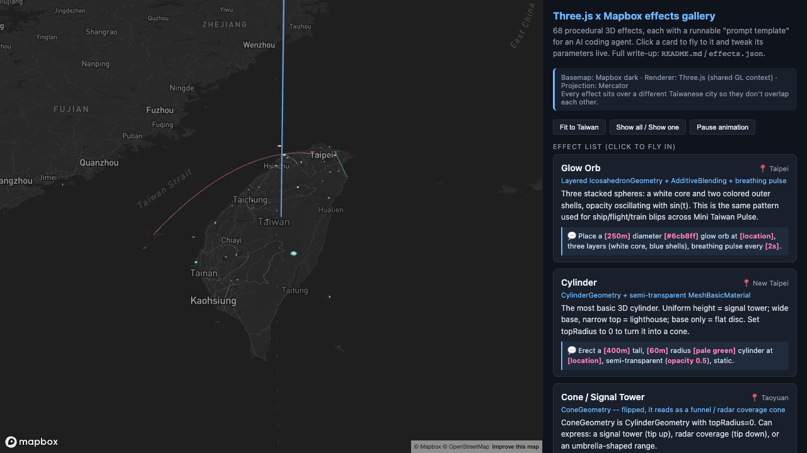
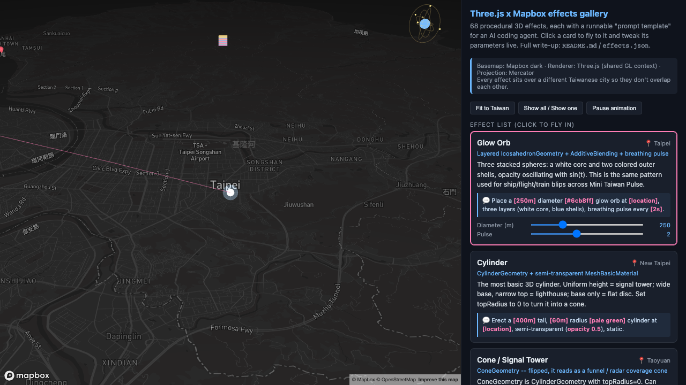

# 08-effects-gallery

> Status: 🔬 **Reproduced** — `npx tsc --noEmit` and `npm run build` pass, and the gallery has been opened in a browser with a real token: the map loads, the effect list renders all 68 cards, clicking a card flies to its location and renders the effect, and its parameter sliders drive it live. Individual effects have not been inspected one by one — see "What hasn't been checked yet" below.



Clicking a card flies to that effect and expands its parameters. Each card carries a **prompt template** — a filled-in instruction you can hand to an AI coding agent to reproduce that effect somewhere else:



A gallery of **68 procedural Three.js effects** rendered through a single shared Mapbox GL JS `CustomLayerInterface` -- glowing orbs, light beams, particle fireworks, sci-fi HUD panels, data-viz bars, and more. Each effect gets its own card in the sidebar with a live parameter panel and an **AI-instruction prompt template** (see "What the `prompt` field is for" below). This is a straight port of an internal case-library demo (`public/showcase/`) from a sibling project (private, not linked here), with the token/CDN/data issues that come with "internal demo" cleaned up for an open-source repo -- see "What changed during the port".

Unlike this repo's other examples, this one doesn't settle a single recipe question -- it's a reference collection you skim for "which effect looks like what I want to build", then copy the one file you need.

## Running it

```bash
cd examples/08-effects-gallery
npm install
cp .env.example .env      # then edit .env and set VITE_MAPBOX_TOKEN
npm run dev
```

Get a free token at <https://account.mapbox.com/access-tokens/>. Without one, the page shows an on-screen message instead of a blank map or a crash -- it never reads any `.env` file that isn't your own, and no token is committed anywhere in this repo.

## What hasn't been checked yet

This example was ported and built without being opened in a browser as part of this port -- hence the Status line above. What *was* verified: `npm install`, `npx tsc --noEmit`, `npm run build`, and `npm run build-effects-index` all succeed (see "TypeScript choice" and "Why no tests" below for what that does and doesn't prove). If you run this with a real token and something looks visually wrong, trust your eyes over this README and open an issue.

## The 68 effects, by category

All 68 effects and all 9 category files from the source are preserved -- **nothing was dropped**. Every effect is self-contained procedural Three.js: no network calls, no textures, no external data files, so nothing here depended on data this repo can't ship (see "What changed during the port" for the one thing that *was* removed: the hardcoded token and CDN loading in the original demo shell, neither of which lived inside the effect files themselves).

| Category | File | Count | What it covers |
|---|---|---:|---|
| Basic geometry | `src/showcase/effects/basic.js` | 8 | Primitive shapes as map markers: glow orb, cylinder, cone/signal-tower, dome, extruded heart & star, a Google-Maps-style 3D pin, a rotating crystal polyhedron. |
| Light effects | `src/showcase/effects/light.js` | 3 | A lighthouse-style light beam, a volumetric "god rays" light cone, and a glowing neon tube path. |
| Animated events | `src/showcase/effects/animation.js` | 12 | Time-boxed or looping animations: expanding ripple, radar sweep, rotating ring, lightning strike, countdown ring, shockwave, contour lines, a selection-highlight ring, a rainbow arch, plus three water-system effects (hydro cycle, flood spread, feedback loop) that live in this file in the actual codebase. |
| Shader deformation | `src/showcase/effects/shader.js` | 4 | Custom vertex/fragment `ShaderMaterial` effects: a swaying "skirt" (vertex displacement), a flowing-gradient surface, an aurora ribbon, and a waving flag. |
| Particles | `src/showcase/effects/particles.js` | 14 | `THREE.Points`/buffer-geometry particle systems: ambient particles, two firework variants, a ballistic arc, tornado, meteor, galaxy, snow, confetti, vortex, waterfall, starfield, plus two water-system particle effects (cascade, evaporation). |
| Lines / paths | `src/showcase/effects/line.js` | 7 | Flow line, OD bezier arc, network web, 3D line chart, plus three water-system effects (watershed tree, Sankey flow ribbon, multi-source converge). Three of these seven (flow line, arc, Sankey) are two-point (`isLine`/`isArc`, positioned via a pair of absolute `MercatorCoordinate`s instead of one); the other four are ordinary single-point effects that just happen to live in this file. |
| Data visualization | `src/showcase/effects/viz.js` | 8 | 3D chart primitives: bar chart, heatmap, pie chart, extruded polygon, waveform, plus three water-system effects (tank, communicating vessels, capacity array). |
| Volumetric / atmosphere | `src/showcase/effects/atmospheric.js` | 3 | Sphere-cluster volumetric looks: smoke, a noise cluster, and a low fog layer. |
| Scene / sci-fi | `src/showcase/effects/scene.js` | 9 | HUD/sci-fi set pieces: floating text label, DNA helix, scanning grid, energy shield, hex grid, glitch effect, checkerboard, orbiting satellite, plus one water-system effect (drought/reservoir). |

**A naming note:** the source project's own internal doc (`docs/three-showcase-library.md`) groups 12 water-system effects (hydro cycle, flood, feedback, watershed, Sankey, converge, tank, vessels, capacity array, cascade, evaporation, drought) under a 10th category, "system relationships / water resources". That doc has drifted from the code: the actual `public/showcase/effects/*.js` files -- which is what this example ports -- file those 12 effects under whichever of the 9 categories above their *shape* belongs to (an animation stays in `animation.js` even if its subject is a flood). This README and `effects.json` follow the code, not the stale doc, since the code is the thing that actually runs. Counts above were verified against each file's `id:` occurrences, not against the doc's table of contents.

## What the `prompt` field is for

Every effect object carries a `prompt` string -- a fill-in-the-blank instruction template (e.g. *"Place a `[250m]` diameter `[#6cb8ff]` glow orb at `[location]`, three layers (white core, blue shells), breathing pulse every `[2s]`."*). This is the whole point of the gallery for an **AI coding agent reading this repo**: instead of describing a desired effect from scratch, you (or an agent working on your behalf) pick the closest card, copy its `prompt`, fill in the bracketed placeholders with real values, and hand that straight to a coding assistant as a concrete, unambiguous spec -- "make it look like this, with these parameters." The sidebar UI shows the same string next to a live parameter panel so a human can sanity-check the numbers before handing them off. See `index.html`'s "How do I turn this into a prompt for an AI coding agent?" panel for the general template this follows.

## `effects.json`

A machine-readable index of all 68 effects: `id`, `category`, `title`, `description`, `prompt`, `tech`, `sourceFile`, `location` (lng/lat/city), and `params` (each with `id`, `label`, `min`, `max`, `step`, `default`). It's generated -- not hand-written -- by `scripts/build-effects-index.mjs`, which imports each `src/showcase/effects/*.js` module the same way the running app does and keeps only the JSON-serializable fields (`JSON.stringify` silently drops the `build`/`update` functions, which is the whole trick). Regenerate it after editing any effect:

```bash
npm run build-effects-index
```

This makes `effects.json` a derived artifact, not a second place that can drift from the code -- unlike the source project's markdown doc (see the naming note above).

## What changed during the port

- **Removed a hardcoded Mapbox token.** The source's `public/three-showcase.html` had a publishable Mapbox access token (the kind that starts with the standard Mapbox public-token prefix) inlined at the top of its `<script type="module">` block. This example never carries a token: `src/main.ts` reads `import.meta.env.VITE_MAPBOX_TOKEN` only, ships `.env.example` with an empty value, and shows the `#token-warning` overlay (plus a `map.on('error')` handler for a bad/expired token) instead of crashing when it's missing -- same pattern as every other example in this repo.
- **Removed the public-CDN `importmap` for Three.js.** The source loaded `three` via a JS `importmap` pointing at a public unbundled-package CDN, and loaded `mapbox-gl` via a dynamically injected UMD `<script>` tag (because the original had no bundler at all -- it was static files under `public/`). This example has no CDN script tags for either library: `three` and `mapbox-gl` are ordinary npm `dependencies` (see `package.json`), resolved and bundled by Vite like any other example here. (The `mapbox-gl.css` stylesheet `<link>` in `index.html` still points at Mapbox's own CDN -- that's this repo's existing convention for every example, e.g. `01-points-on-globe`, and is a stylesheet, not executable code.)
- **No project data was carried over.** Checked: none of the 68 effects `fetch()` anything, import a texture/image/JSON/GLTF asset, or touch Supabase -- every one is pure procedural Three.js with hardcoded synthetic parameters (the source project's real ship/flight/train data lives in a completely different part of that codebase, `src/three/*Scene.ts`, which this gallery never touched). The per-effect `loc`/`lineEnd` coordinates are decorative placement (one Taiwanese city per effect, so they don't overlap on the map) picked by the demo's original author, not real sensor or database data, and were kept as-is.
- **Translated to English.** Every `name`, `city`, `tech`, `desc`, `prompt`, param `label`, and inline code comment was translated from Traditional Chinese. Numeric values, geometry/shader math, control flow, and every identifier (`id` strings included) were left untouched -- this was a translation pass, not a rewrite. `docs/three-showcase-library.md` (the source project's companion doc, itself not ported) was consulted for phrasing but the code was always the source of truth where the two disagreed (see the naming note above).
- **Nothing was dropped.** All 9 category files and all 68 effects made it across; see the table above.

## TypeScript choice

The source is vanilla JS with no type annotations. Two options were on the table: convert all 68 effects to typed `.ts`, or keep them as `.js` and configure `tsc` to accept that. **This example keeps `src/showcase/effects/*.js` and `src/showcase/core/*.js` as plain JavaScript**, with `"allowJs": true, "checkJs": false` in `tsconfig.json` so `main.ts` can import them without `tsc --noEmit` trying to type-check their bodies.

Reasoning: converting ~4,100 lines of Three.js geometry/shader/particle-physics code across 68 effects to strict TypeScript (this repo's other examples all use `"strict": true`) is real, error-prone work for very little payoff -- a typo introduced while adding type annotations to, say, a custom `BufferAttribute` particle update loop would be a silent visual bug, not a caught type error, since none of this math is exercised by tests either way (see "Why no tests" below). Keeping the ported files behaviorally identical to the source (translation only) was judged lower-risk than a rewrite for a part of the codebase that's explicitly "copy the file you like," not "build on top of this abstraction."

This was checked, not assumed: for each of the 9 category files, source and ported file were normalized (strip `//`-style comments, blank out the string value of every `name`/`city`/`tech`/`desc`/`prompt`/param-`label` field) and diffed. 8 of 9 files are then byte-identical; the one exception is `scene.js`, whose `text` effect draws a demo label onto an HTML canvas with `ctx.fillText(...)` -- that literal string was translated too (`"✨ 日月潭 ✨"` -> `"✨ Sun Moon Lake ✨"`), which is exactly the kind of translatable text this pass expects to differ. No numeric value, geometry/shader argument, control-flow, or identifier changed in any of the 68 effects. The small amount of *new* code written for this port -- `src/main.ts`, `.env`/token handling -- is ordinary strict TypeScript, same as every other example here.

## Why no tests

This repo's other examples (`00`–`04`) each carry a `.test.ts` file because they isolate one piece of pure, non-graphics math (ECEF projection, arc subdivision, backface-cull thresholds) that can be checked without a GPU. This gallery has no equivalent: every effect's `build`/`update` function's job *is* mutating Three.js objects (geometries, materials, positions, buffer attributes) directly -- there's no pure function underneath worth extracting and unit-testing in isolation, and a test that mocked out the entire Three.js API surface to assert "this line got called with these arguments" wouldn't tell you anything about whether the effect looks right. Visual correctness here can only be checked by looking at it, which is exactly the "visual verification pending" caveat in the Status line. `vitest` is intentionally not a dependency of this example (see the CDN/dependency list rule in `../../CONTRIBUTING.md`).

## Hugging the globe

Every effect places itself with a **single absolute `mapboxgl.MercatorCoordinate`**, computed once in `core/layer.js`'s `onAdd()` (or, for the three two-point line/arc effects -- flow line, arc, Sankey -- a pair of them). None of the 68 effects, and neither of the two core files, reads Mapbox's globe render arguments (`projection`, `projectionToMercatorMatrix`, `projectionToMercatorTransition`). **Zero of them handle globe projection correctly out of the box** -- this repo's own recipe doc, [1.1 Hugging the globe: Mapbox GL JS](../../docs/01-hugging-the-globe/mapbox.md), is explicit that `CustomLayerInterface` is mercator-only unless you do the sphere/flat blend yourself, and that's exactly the gap here. `src/main.ts` sets `projection: "mercator"` for this reason, matching the source demo.

One nuance worth flagging if you experiment with switching to `projection: "globe"` anyway: `01-points-on-globe`'s own README reports the globe->mercator blend already fully flat (`transition: 1.00`) at z7.33, its highest measured point -- that's one observed value, not a documented threshold, so treat it as an upper bound rather than the exact zoom where the blend finishes. Most cards here `flyTo()` zoom 12, comfortably past that observed point, so those effects would likely still land correctly once you've clicked in. The three two-point (line/arc) `flyTo()`s -- flow line, arc, Sankey -- use z7.2-9.5 depending on endpoint distance -- z7.2 sits right at the edge of what 01 actually measured, so whether *that* one lands flat or still mid-blend isn't something this README can tell you. The drift described above is clearest in the z6.6 all-effects overview, where the base map is still rendering as a sphere.

If you want one of these effects to hug the sphere, don't rewrite all 68 -- apply recipe 1.1 once to `core/layer.js` (precompute each point's ECEF position at build time, add the vertex-shader `mix()` blend, add the ECEF backface cull), the same way [`examples/01-points-on-globe`](../../examples/01-points-on-globe/) does it for its glow points. That recipe was written for exactly this "I have a working mercator custom layer, now make it globe-safe" situation.

## License

The ported effect code, the harness (`src/main.ts`, `index.html`), and `effects.json` are MIT, same as the rest of this repo (see [LICENSE](../../LICENSE)). Mapbox GL JS itself is a normal npm dependency here but ships under [its own, non-open-source license](https://raw.githubusercontent.com/mapbox/mapbox-gl-js/main/LICENSE.txt) -- see the root README's licensing note.
