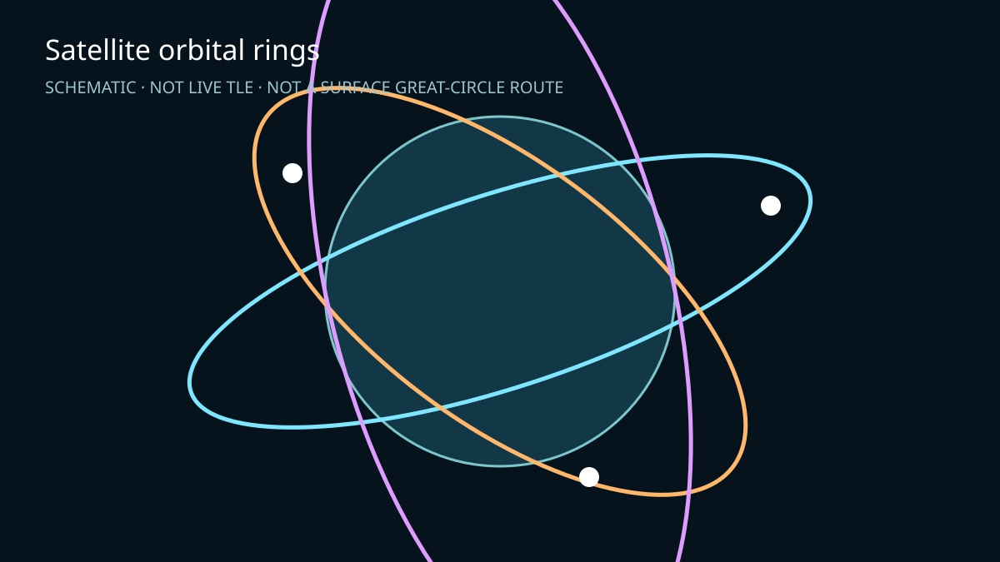

# 09-satellite-orbits

> Status: ⚠️ **Unverified in browser** — unit geometry checks, TypeScript, and build are provided; browser validation still requires a real Mapbox token.



<sup>Illustration only; not browser-rendering evidence.</sup>

Mapbox-first custom-layer demo of three **schematic** circular orbital shells. Each is a closed, densely sampled inclined ring at a radial altitude above the globe, with a moving satellite marker. They are intentionally not two-point great-circle arcs and not surface-hugging trajectory data.

The orbital elements are illustrative only: no live TLE is loaded, propagated, or implied. The HUD keeps this visible and exposes altitude exaggeration plus playback speed.

## Run

```bash
cd examples/09-satellite-orbits
npm ci
cp .env.example .env # set VITE_MAPBOX_TOKEN
npm run dev
```

## Checks

`npm run test` checks closed sampling, radius/altitude separation from Earth, and inclination-induced north/south displacement. `npm run typecheck` and `npm run build` are separate checks. The custom layer disables depth testing, culls the far hemisphere in ECEF, resets shared WebGL state before and after render, and disposes all Three.js geometry/material/renderer resources in `onRemove`.
