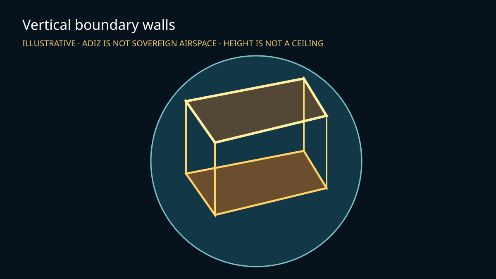

# 10 — Vertical boundary walls

> Status: ⚠️ **Unverified in browser** — globe projection, antimeridian-safe wall geometry, GPU cleanup, typecheck and unit checks are included. Browser visual verification still requires a real Mapbox token.



<sup>Illustration only; not browser, legal-boundary, or Mapbox-service evidence.</sup>

A Mapbox GL JS + Three.js custom-layer demonstration of a reusable *Vertical boundary walls* component. `createVerticalBoundaryWallLayer(data, controls)` accepts GeoJSON-like `Polygon` and `MultiPolygon` geometry; every exterior ring and hole becomes side walls, with no top fill. This page injects a Taiwan ADIZ schematic solely as an illustrative fixture.

## Important interpretation boundary

- An ADIZ is **not sovereign airspace**.
- The bundled five-corner ring is an **illustrative schematic approximation**, not an AIP, legal, navigation, or operational boundary. This example intentionally does not bundle a claimed-authoritative ADIZ source or licence.
- The slider is **schematic display height**, not a published ceiling. No verified ceiling is available to this example; unknown is kept unknown rather than converted to `0` or presented as an upper limit.

## Run

```bash
cd examples/10-adiz-walls
npm install
cp .env.example .env
# Set VITE_MAPBOX_TOKEN in .env
npm run dev
```

## What the custom layer does

- `src/wallGeometry.ts` validates finite longitude/latitude coordinates and rejects empty rings and latitudes outside Web Mercator. It removes duplicate closing coordinates, unwraps ±180° incrementally, and great-circle densifies long edges before emitting two side triangles per segment.
- `src/verticalBoundaryWallLayer.ts` precomputes Web Mercator and ECEF attributes. On a globe it blends through Mapbox's globe-to-Mercator transition, disables depth testing, and uses camera-to-wall sphere intersection for far-side visibility (so raised walls are not treated as surface-only geometry).
- One renderer owns one custom layer. `onRemove()` disposes geometry, material, and renderer resources, allowing remove/re-add without retaining this layer's GPU objects.

## Input contract

```ts
createVerticalBoundaryWallLayer(
  { type: "Polygon", coordinates: [[[lon, lat], ...]] },
  { getDisplayHeightMeters: () => 280_000, maxSegmentMeters: 100_000 },
);
```

Coordinates use `[longitude, latitude]` in degrees. Rings may be closed or unclosed. Polygon holes and every MultiPolygon member become vertical side walls; this component does not make a roof. `getDisplayHeightMeters` is meters and is strictly display styling, never a boundary altitude, ceiling, legal limit, or source datum. Empty rings, non-finite coordinates, and latitudes outside ±85.05112878 are rejected explicitly.

## Checks

```bash
npm ci
npm run typecheck
npm test
npm run build
```

The unit tests prove multi-ring/multi-polygon side generation, closed final edges, antimeridian unwrapping, densification, invalid-input rejection, and disposal helper behavior. They cannot prove real WebGL appearance, Mapbox projection internals, or make the schematic fixture authoritative.
