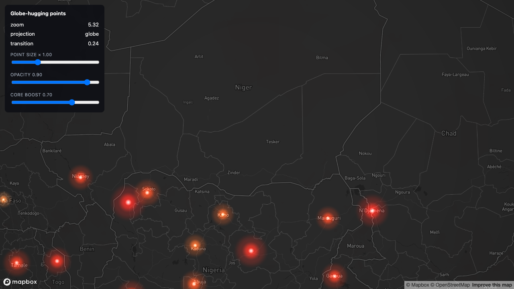
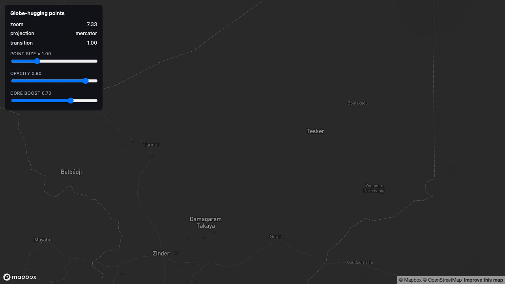

# globe-hugging-points

> Status: 🔬 **Reproduced** — builds clean, 13/13 unit tests on the projection maths, and visually verified end to end (screenshots below, taken from this example at `mapbox-gl` 3.18.1).


The whole recipe in three states, captured from the running example:

| Zoom | `projection` | `transition` | What it shows |
|---|---|---|---|
| 1.30 | `globe` | `0.00` | Points sit **on** the sphere. The far side is culled — no ghost light bleeding through the planet's core. Coastal chains compress into bright arcs at the limb, which is the geometry being correct, not a bug. |
| 5.32 | `globe` | `0.24` | Mid-blend. Points stay registered on Niamey, Kano, Kaduna, Maiduguri, N'Djamena, Abuja while the projection is still partly spherical — this is what the `mix()` in the vertex shader is for. |
| 7.33 | `mercator` | `1.00` | Fully flat. The early-out kicks in and the layer costs exactly what a non-globe layer costs. |

 

Glowing airport points on a Mapbox GL JS globe, using a Three.js `CustomLayerInterface`. Points hug the sphere at low zoom and blend smoothly back to flat Web Mercator as you zoom in past z5–z6. This is the runnable companion to [1.1 Hugging the globe: Mapbox GL JS](../../docs/01-hugging-the-globe/mapbox.md) — the code here follows that document step for step; if you find a place where they disagree, the doc is what's wrong (please open an issue).

## What it demonstrates

- Reading the three undocumented arguments `render()` receives in globe projection: `projection`, `projectionToMercatorMatrix`, `projectionToMercatorTransition`.
- Precomputing each point's ECEF (Earth-Centered-Earth-Fixed) position once, at data-load time, instead of every vertex every frame.
- Blending sphere↔flat in the vertex shader with a four-line `mix()`, and an early-out that makes flat-map rendering cost exactly what it cost before.
- Backface culling done in ECEF space (not mercator space), so the far side of the globe fades like atmosphere instead of bleeding through as "ghost light" under additive blending.
- Every material set to `depthTest: false` — required once Mapbox has already drawn a solid, depth-writing sphere into the shared framebuffer before your layer runs.
- A cheap pseudo-bloom look (three nested radial falloffs + additive blending) with zero postprocessing passes.

## Running it

```bash
cd examples/globe-hugging-points
npm install
cp .env.example .env      # then edit .env and set VITE_MAPBOX_TOKEN
npm run dev
```

Get a free token at <https://account.mapbox.com/access-tokens/>. Without one, the page shows an on-screen message instead of a blank map or a crash — it never reads any `.env` file that isn't your own, and no token is committed anywhere in this repo.

## Verifying it without a token

This example was built and verified without ever opening it in a browser (no Mapbox token was available while writing it) — see the Status line above. What *was* verified:

```bash
npx tsc --noEmit    # 0 errors
npx vitest run      # 13/13 tests pass
npm run build        # succeeds (vite build)
```

The unit tests (`src/globeProject.test.ts`) cover the ECEF math and the sphere/flat blend in isolation — axis signs, radius invariants, the bit-identical flat-map early-out, and the backface cull's near/far behavior. The lon/lat cases use a fixed list (poles, antimeridian, both hemispheres, a few arbitrary mid-latitude points) rather than randomized sampling, deliberately — a fixed list is reproducible and still exercises the edge cases (`cosLat -> 0` at the poles, `sinλ`/`cosλ` sign flips across the antimeridian) that matter most for this math. They do not, and cannot, verify that the shader compiles and looks right in an actual WebGL context. If you run this with a real token and something looks wrong, trust your eyes over this README.

## Adjustable parameters

| Control | Where | Default | Effect |
|---|---|---|---|
| Point size × | HUD slider | 1.0 (range 0.2–3) | `uSizeMul` — scales every point's pixel size |
| Opacity | HUD slider | 0.9 (range 0.1–1) | `uOpacity` — overall glow alpha |
| Core boost | HUD slider | 0.7 (range 0–1) | `uCoreBoost` — how hard the point center is pushed toward white |
| `MIN_POINT_SIZE_PX` / `MAX_POINT_SIZE_PX` | `src/glowPointsScene.ts` constants | 10 / 56 | Pixel size range `sizeNorm` maps into |
| `MAX_POINT_COUNT` | `src/glowPointsScene.ts` constant | 4096 | Fixed buffer capacity — raise if you swap in a bigger dataset |
| Backface cull thresholds | `smoothstep(-0.08, 0.02, d)` in `src/globeProject.ts` | fixed | How wide/soft the horizon fade is; wider (e.g. `-0.25, 0.05`) hides the horizon seam more aggressively at the cost of visible clipping sooner |
| Zoom reference | `setZoom(zoom, referenceZoom = 3)` in `src/glowPointsScene.ts` | 3 | Zoom level at which glow size is "1×" before the size slider |

## Data: what's real and what's synthetic

- **Positions and names are real.** `public/airports.json` is produced by `scripts/fetch-airports.mjs` from [OurAirports](https://ourairports.com/data/airports.csv) (public domain, no attribution required), filtered to `type === "large_airport"`. As fetched for this example, that's **1,174 airports** — noticeably more than the ~400–500 this example's spec estimated, because the live OurAirports dataset has grown since that estimate was written. The script keeps only `ident`, `name`, `lon`, `lat`.
  The file is shaped `{ source, fields: ["ident","name","lon","lat"], airports: [[ident, name, lon, lat], ...] }` — **array-of-arrays, not array-of-objects** — purely to keep the file small: repeating four key names across 1,174 records would cost ~33KB for zero benefit (103KB vs the 71KB this format produces). `src/airports.ts` is where it gets turned into the `{lon, lat, colorHex, sizeNorm}` shape the render code actually wants.
- **Point size and color are synthetic.** OurAirports doesn't publish traffic figures, so `src/airports.ts` derives a stable, arbitrary "weight" per airport from a hash of its `ident` code, sqrt-compresses it, and maps that to both point size and a white→orange→red color ramp. This produces a plausible-looking "some airports are bigger/brighter than others" pattern, but it has **no relationship to actual passenger or flight volume** — don't read anything into which airports render large.
- **Fallback:** if `scripts/fetch-airports.mjs` can't reach the network, it generates 500 points evenly spread over the sphere (a Fibonacci-sphere spiral) instead of fabricating airport-shaped data. Check `public/airports.json`'s own `"source"` field — it says `SYNTHETIC` in that case. This example's own `public/airports.json` was generated with the network reachable, so it ships the real OurAirports data.

To regenerate the data file yourself:

```bash
npm run fetch-airports
```

## Where the math comes from

`src/globeProject.ts` holds a GLSL string (`GLOBE_PROJECT_GLSL`, prepended to the vertex shader in `src/glowPointsScene.ts`) and a JS function (`mercatorToGlobe`) that implement the *identical* math, so the JS version can be unit-tested without a WebGL context. Both follow [the recipe doc](../../docs/01-hugging-the-globe/mapbox.md) exactly:

- `GLOBE_RADIUS = 8192 / (2π)`
- ECEF: `x = cosφ·sinλ·R`, `y = −sinφ·R` (the negative sign is intentional — see the doc), `z = cosφ·cosλ·R`
- Altitude as a radial offset: `hEcef = mercZ · 8192 · cosLat`
- `uTransition`: 0 = sphere, 1 = flat plane (note: this is the *opposite* direction from MapLibre's equivalent — see [1.3 Porting](../../docs/01-hugging-the-globe/porting.md) if you're comparing against a MapLibre example)
- Backface cull computed in ECEF space, with the camera converted from mercator to ECEF via `inverse(projectionToMercatorMatrix) · camera` — loading the matrix and *then* inverting it, in that order (see the doc's "trap that costs the most time")

## Deliberate simplifications

Compared to the production code this recipe was extracted from, this example leaves out:

- **Popups / hit-testing.** Custom layers don't participate in `queryRenderedFeatures`; a production layer would keep an invisible native `circle` layer alongside this one for click/hover interaction. This example has neither.
- **Repaint throttling.** `glowLayer.ts` calls `map.triggerRepaint()` unconditionally on every frame to keep the size-pulse animation smooth. Production code throttles this (e.g. down to ~20fps while idle, stopping entirely after ~30s of no activity) via a shared scheduler across multiple layers — that infrastructure is orthogonal to globe-hugging itself and was cut for clarity. Don't copy the "always repaint" line into something with a real GPU budget.
- **Multiple color modes.** The production version this was extracted from can switch between a traffic-based ramp and a discrete status-based palette. This example has exactly one ramp, and it's synthetic (see above) either way.
- **Limb-fade widening at far zoom.** Some production variants widen the backface-cull falloff at very low zoom so the horizon seam is less visible from far away. This example uses one fixed cull width at all zooms.
- **A stricter backface cull than some production points layers use.** This example's cull (`uCameraEcef`, true ECEF space, `smoothstep(-0.08, 0.02, ...)`) is the recipe doc's method. At least one production glow-points layer this example draws on uses an older, looser variant instead — camera kept in mercator space, normal computed as `mat3(uGlobeToMerc) * aEcef`, and a wider `smoothstep(-0.25, 0.05, ...)`. Both hide the far side; the doc's version does it in the geometrically correct space. If you're porting from a points layer elsewhere and its horizon looks different from this example's, this is why.
