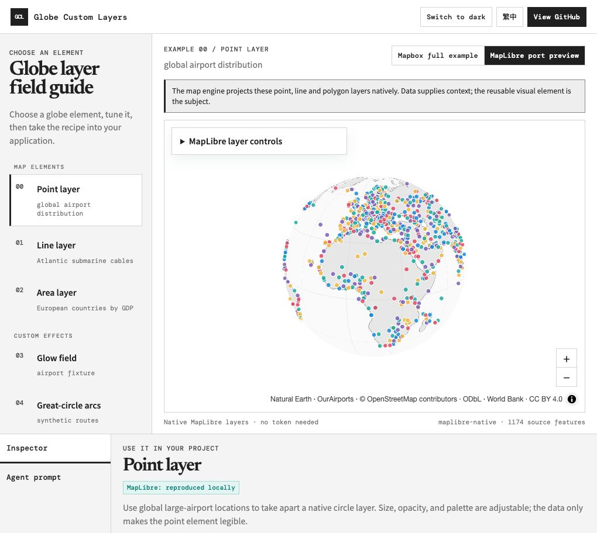

# Globe Custom Layers atlas demo

The cartographic-lab workspace puts element selection on the left, an interactive globe in the center, and recipes/source/Agent prompts in the inspector. Its first group is **Map elements**: Point layer / global airports, Line layer / North Atlantic submarine cables, and Area layer / European countries by 2023 GDP. The reusable geometry and style controls lead; data is supporting context. A second group covers custom glow, great-circle arc, mass-trajectory, satellite-orbit, and vertical-boundary-wall effects.



<sup>Current local atlas baseline. The image is the token-free MapLibre point scene, not evidence of Mapbox service access.</sup>

Every selected element has a **Mapbox full example** and a **MapLibre preview**. The site opens in the token-free MapLibre mode; Mapbox uses the visitor's public token and mounts only the selected standalone example. Five custom MapLibre scenes cover airport glow, raised arcs, mass tracks, elevated satellite rings and vertical boundary walls; the wall component is demonstrated with a Taiwan ADIZ schematic. A visible notice explains the horizon/limb, blending, and depth differences. The first three reuse their standalone Three.js scene sources through `maplibreCustom.ts`; the orbit and wall scenes use the focused `specialScenes.ts` adapter. These are different implementations, not an engine capability comparison.

`examples/manifest.json` `siteScenes` is the source for scene identity, component/fixture wording, input contracts, required files, acceptance gates and Agent prompts. The build generates `sceneCatalog.js` from that manifest, so the UI does not maintain a second hand-written prompt catalogue. The prompt identifies the target repo and map entrypoint, expected data count/update rate, interactions, coordinate units, missing/error behavior, required sources, evidence cells, licence and fixture semantics.

The interface opens in English and can switch to Traditional Chinese. The shell and selected custom examples support light/dark themes; the two new native Mapbox line/area examples currently keep Mapbox's light basemap in either shell theme. Parameter panels start collapsed in embedded views and expand only on request; changing the selected free scene collapses the panel again so it does not cover the globe. The light interface and all local light basemap presets use only white and neutral grays so the visualization carries the color. Native point, line, and area scenes expose geometry-specific controls. GDP color represents the documented total-GDP bands; airport point hues and cable color choices are presentation styles rather than measured categories. Glow points default to Plasma at 0.60 size, 0.65 opacity and 0.85 core boost; points and arcs expose five visible palette buttons. Light custom geometry uses normal alpha blending; dark mode retains additive glow.

Both modes support the site's light/dark appearance. The interface offers Traditional Chinese and English, larger text, and a direct path from the effect to its GitHub source and an Agent task prompt. IBM Plex Sans TC, IBM Plex Sans, and IBM Plex Mono are pinned npm dependencies and emitted as self-hosted, Unicode-split WOFF2 assets; no third-party font request is made at runtime. This remains a cookbook entry point, not a data service or an engine-independent rendering library.

## Why MapLibre works here

[MapLibre officially supports globe rendering](https://maplibre.org/maplibre-gl-js/docs/examples/display-a-globe-with-an-atmosphere/), including [custom layers through its own projection API](https://maplibre.org/maplibre-gl-js/docs/examples/add-a-simple-custom-layer-on-a-globe/). This website uses the MapLibre projection prelude in `maplibreCustom.ts` to reproduce the selected Three.js scenes locally. The direct ECEF/mainMatrix path remains unverified; terrain, depth-tested 3D and portability to the remaining standalone examples are outside this status. The token-free bundle aliases `mapbox-gl` to a MercatorCoordinate-only shim and contains no Mapbox SDK.

The browser reproduction covers 190 raised arcs / 19,760 vertices at the current 53-sample default and 5,000 tracks in 4,096 slots with one draw call. It also shows three inclined satellite rings with animated markers and a geodesically densified vertical-boundary-wall component using a Taiwan-area ADIZ schematic at a 500 km display height. The live controls change orbit altitude scale, simulation speed and pause/resume state, and wall display height. Points retain the source point-size path; the adapters rely on MapLibre's official horizon clip. Light mode uses normal blending for visibility on white, while dark mode uses additive blending for highlights. The limb soft fade therefore differs from Mapbox and is not pixel-identical. The adapters use `projectTileWithElevation()` with metre heights and `depthTest: false`; measured depth-tested 3D cut points, so this README makes no terrain/depth claim.

MapLibre's license is bundled in `dist/vendor/maplibre-LICENSE.txt`. Local Natural Earth and OurAirports files avoid dependence on a third party's free tile quota or demo-server policy. Hosting and bandwidth still belong to whoever serves the site; this is not a promise that arbitrary commercial basemap services are free.

## Preview data

- `land.json`: Natural Earth 1:110m land polygons, downloaded 2026-09-05 from the [Natural Earth vector repository](https://github.com/nvkelso/natural-earth-vector/blob/master/geojson/ne_110m_land.geojson). [Natural Earth data is public domain](https://www.naturalearthdata.com/about/terms-of-use/). It is generalized cartography, not precise survey geometry.
- `airports.json`: the existing 1,174-record OurAirports fixture copied from example 01, including its source metadata. Airport locations are not a live event feed.
- `data/atlantic-submarine-cables.geojson`: 281 generalized North Atlantic communication-cable LineStrings queried from OpenStreetMap through Overpass on 2026-09-05. It retains © OpenStreetMap contributors / ODbL 1.0 attribution and the incomplete-crowdsourced boundary; it is not an engineering chart or complete inventory.
- `data/europe-gdp-2023.geojson`: 50 Natural Earth 1:50m European map units joined to World Bank 2023 GDP (current US$). Four missing GDP values remain `null` and render as no-data gray, never zero. Natural Earth boundaries are a de facto cartographic representation, not a legal boundary statement.
- Preview routes and moving tracks are synthetic illustrations. Their appearance/counts are not runtime performance measurements from the WebGL examples.
- Satellite rings use three local schematic circular-orbit parameter sets; they are not live TLE propagation or a real satellite catalogue.
- **Vertical boundary wall fixture** — the current data is an illustrative five-corner Taiwan-area ADIZ schematic. An ADIZ is not sovereign airspace, and its 500 km wall is display height rather than an asserted ceiling.

These data files are bundled locally; browsing the free globe does not request Mapbox tiles or require a Mapbox token. Full provenance and generator scripts are recorded in [the data-source note](../docs/data-sources.md).

## Fresh clone

Install the pinned MapLibre and IBM Plex dependencies for the site and the eight independently bundled example dependencies before building:

```sh
(cd site && npm ci)
(cd examples/00-native-vs-custom && npm ci)
(cd examples/00-native-lines && npm ci)
(cd examples/00-native-choropleth && npm ci)
(cd examples/01-points-on-globe && npm ci)
(cd examples/02-arcs-on-globe && npm ci)
(cd examples/05-mass-trajectories && npm ci)
(cd examples/09-satellite-orbits && npm ci)
(cd examples/10-adiz-walls && npm ci)
node site/scripts/build.mjs
```

The build writes `site/dist`. It sets `VITE_MAPBOX_TOKEN` to an empty string and gives Vite a newly-created empty `envDir`; it never reads an example `.env`.

## Container deployment

Build from the repository root, then run the static image on port 8080:

```sh
docker build -t globe-custom-layers .
docker run --rm -p 8080:8080 globe-custom-layers
```

The multi-stage image uses Node 22 to run `npm ci` independently for the site and all eight embedded examples, then runs a token-neutral site build with an empty `VITE_MAPBOX_TOKEN`. Its final Nginx image contains only `site/dist` and the port-8080 static-server configuration. The Docker allowlist and `.dockerignore` exclude local `.env` files, so no deployment token or runtime API is required.

On Zeabur, deploy this repository's `main` branch with the service Root Directory left empty. Its [Dockerfile deployment](https://zeabur.com/docs/en-US/deploy/methods/dockerfile) detects the root Dockerfile and exposed port 8080. Do not configure `VITE_MAPBOX_TOKEN`: this static site needs no service environment variables, and visitors supply their own public token in the browser. Verified release history is recorded in the implementation record; every new merge still requires its own deployment readback.

## Preview and deployment base path

Serve `site/dist` as the static document root:

```sh
cd site/dist && python3 -m http.server 4173
```

Open `http://localhost:4173`. All shell, preview-data, screenshot, iframe, and iframe-asset URLs are relative, so the directory may also be served under a project subpath such as `/demos/globe/`. The parent and iframe must share an origin for the handshake.

A visitor enters a public `pk.` token in the left session panel. The shell stores it in this tab's `sessionStorage` so scene changes and reloads do not ask again, then gives it to the single selected iframe after a source-and-origin-checked `postMessage` handshake. Closing the browser session or choosing **Forget this token** clears it. Only one iframe is mounted at once so the demo does not retain inactive WebGL contexts. `ready` means the iframe is waiting for a runtime token; it is separate from the `map.on("load")` signal shown in the shell.

In explicit embed mode, the iframe gives the Mapbox SDK a memory-backed `localStorage` surface. This prevents its token-keyed telemetry identifiers from reaching the origin's persistent storage. Removing the iframe discards that state; standalone examples retain the SDK's normal storage behavior. The public token is sent to Mapbox in map requests, but is not put in URLs, cookies, logs, or built assets.

The demo does not submit the token to an application backend. `sessionStorage` is intentionally less persistent than `localStorage`, but any same-origin script can access it, so visitors must use a URL-restricted public token and never a secret token. This describes the application's storage behavior; it does not claim that Mapbox or browser network tooling never sees a token-bearing request. Create a public token through [Mapbox account signup](https://account.mapbox.com/auth/signup/) and [token management](https://account.mapbox.com/access-tokens/); [Mapbox documents public token scopes and URL restrictions](https://docs.mapbox.com/accounts/guides/tokens/).

## Verification boundary

The 20 site tests cover handshake origin/source checks, session-token retention and forgetting, plus the static DOM/data/style contracts for local basemaps, native layers, custom-effect controls, schematic semantics, favicon/social metadata, and the self-hosted IBM Plex build. Typechecking and the build cover the selected iframe bundles, including their relative fixture paths. Token-free MapLibre browser inspection covers the five custom scenes. A deliberately supplied public token also reproduced the standalone satellite-orbit and vertical-wall fixtures against real Mapbox tiles on 2026-09-06; this was a local renderer check, not the site's visitor-token flow or production Mapbox-mode verification.

The [implementation record](../docs/demo-implementation-plan.md) separates the completed fixture runs from non-fixture antimeridian/hole checks, observed GPU cleanup, production visitor-token entry and quantitative alignment. The test-only Mapbox style interception is not shipped. Free MapLibre mode is a locally and publicly reproduced custom-layer port preview; it does not verify the direct ECEF/mainMatrix hypothesis, terrain/depth behaviour, or the remaining standalone examples.


To repeat the token-free GPU checks after building, copy `site/tests/maplibre-port.html` to `site/dist/port-check.html`, serve `site/dist`, and open `/port-check.html`. The page reports geometry counts, changed height, paused/resumed GPU image hashes, front/back clipping, projection endpoints and the 0.5 transition coefficient. Remove that copied test page before publication. These browser checks require WebGL; the Node contract tests do not. Initially paused/reduced-motion tracks display a synthetic time-five-seconds snapshot so existing trails are visible.

Mass trajectories now start at **600 objects**, **0.3× speed**, **0.70 opacity**, and the **Warm** palette in both engines. Controls retain the wider object-count, speed, opacity, pause/resume, and Multicolor/Cool/Warm ranges. Colors distinguish synthetic objects; they do not encode real flight categories. Palette changes update shader uniforms, and count changes also take effect while paused. The 5,000-object figures above describe the retained capacity stress check.
